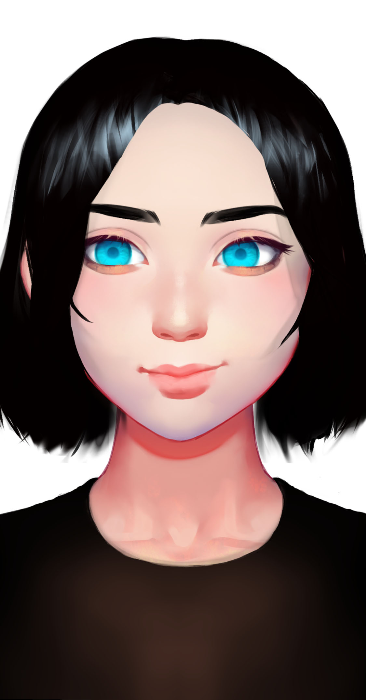

# 梁夜

## **基本信息**

种族：生命方程改造人

年龄：19岁少女

性别：女

体重：60公斤

身高：185厘米

发色：黑色

瞳色：蓝色，眼神犀利

外貌特征：黄金分割的美，永远的19岁少女

衣着风格：黑色战甲

生日：2098/04/12

## **性格特征**

性格特征：INTJ，冷酷智慧

经常携带的武器：无

语癖：博学而坚定，指挥官气质

习惯性动作：无

## **角色定位**

角色身份：女一

角色站位：正派

职业：星龙战将

头衔：星龙战将

原型：无

## **进阶信息**

重要的东西：智慧

重要的情感：守护共和国

喜欢的东西：知识和学识

讨厌的东西：闲话

目标或追求：让共和国重归辉煌

底线：不伤害无辜的人

自己不会逾越界限去做的事情：欺上媚下

因为某种情感而经常做的事情：杀人

## **关系**

母亲：[思唯](../synthetics/si-wei.md)

父亲：[梁风](../xinglongians/liang-feng.md)

## **简介**

梁夜是梁风的女儿，叫夜儿因为她要永远仰望星空。她是共和国第一批星龙骑士之一。经过基因改造后，她的有机体寿命可以长达500岁，也可以接入克隆体，进行一次又一次的重生。她的思想和躯体都被冷冻，以备共和国的需求。终于在共和国衰落后，人们唤醒了她。
