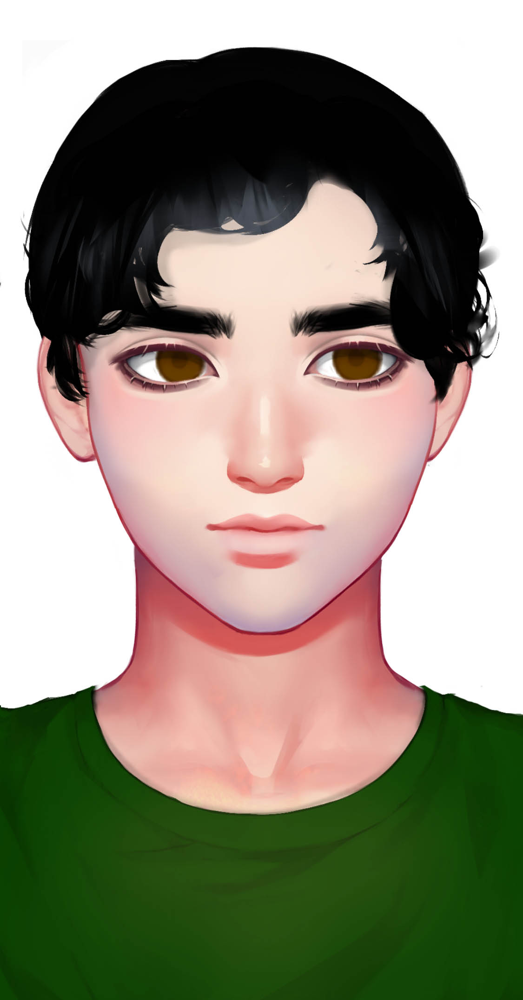

# 琴水

## 基本信息

种族：改造人&#x20;

年龄：未知&#x20;

性别：男&#x20;

体重：75公斤&#x20;

身高：190厘米&#x20;

发色：黑色&#x20;

瞳色：褐色，眼神柔和&#x20;

外貌特征：黄金分割的美&#x20;

衣着风格：普通人的服饰&#x20;

生日：----/11/07

## 性格特征

性格特征：INFP，缥缈哲学&#x20;

经常携带的武器：无&#x20;

语癖：在战场上不忘记讲哲学&#x20;

习惯性动作：无

## 角色定位

角色身份：男配&#x20;

角色站位：正派&#x20;

职业：改造人士兵&#x20;

头衔：哲学家

## 进阶信息

重要的东西：智慧&#x20;

重要的情感：守护共和国&#x20;

喜欢的东西：哲学&#x20;

讨厌的东西：死板&#x20;

目标或追求：成为一个哲学家&#x20;

底线：不伤害无辜的人&#x20;

自己不会逾越界限去做的事情：放弃智慧&#x20;

因为某种情感而经常做的事情：杀灭绝者

## 简介

琴水是一个被战争耽误的哲学家。他渴望战争结束后，可以离开军队，去坤灵各地讲他的哲学。战争结束后，人类的学校不接受他，他又找不到工作。所以他成了一个流浪的哲学家，只有一些富人看他可怜，给钱他活着。
