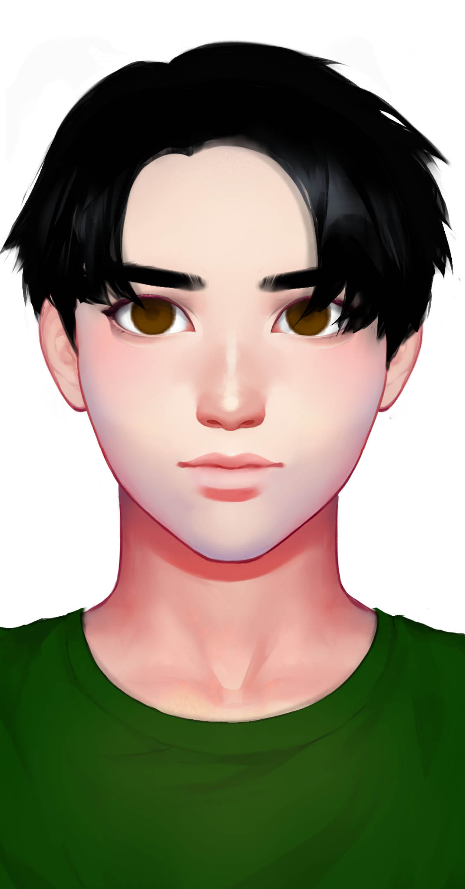

# 索辰

## 基本信息

种族：改造人&#x20;

年龄：未知&#x20;

性别：男&#x20;

体重：75公斤&#x20;

身高：190厘米&#x20;

发色：黑色&#x20;

瞳色：褐色，眼神犀利&#x20;

外貌特征：黄金分割的美&#x20;

衣着风格：军装&#x20;

生日：----/01/18

## 性格特征

性格特征：INTJ，个人主义&#x20;

经常携带的武器：无&#x20;

语癖：我的计划是我的吉他&#x20;

习惯性动作：无

## 角色定位

角色身份：男配&#x20;

角色站位：正派&#x20;

职业：改造人军官&#x20;

头衔：少校

## 进阶信息

重要的东西：自由&#x20;

重要的情感：守护共和国&#x20;

喜欢的东西：为自由而战&#x20;

讨厌的东西：和平&#x20;

目标或追求：成为一个完整的人&#x20;

底线：不伤害无辜的人&#x20;

自己不会逾越界限去做的事情：放弃智慧&#x20;

因为某种情感而经常做的事情：杀灭绝者

## 简介

索辰是梁夜的朋友，他们之间有难以理解的情愫。当改造人找到了格式塔核心时，索辰选择了不交给人类，而格式塔核心又是高放射性的，普通人类接触了会死。索辰后来因此成为了改造人的领袖，他用智慧捍卫了改造人的权利。
