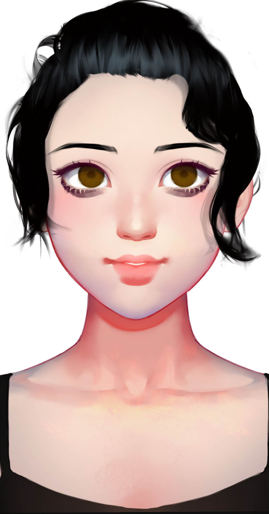

# 源丁

## 基本信息

种族：改造人&#x20;

年龄：-&#x20;

性别：女&#x20;

体重：50公斤&#x20;

身高：175厘米&#x20;

发色：黑色&#x20;

瞳色：褐色，眼神忧郁&#x20;

外貌特征：黄金分割的美&#x20;

衣着风格：黑色长裙

生日：2092/02/17

## 性格特征

性格特征：INFJ，温暖智慧&#x20;

经常携带的武器：无&#x20;

语癖：作家气质&#x20;

习惯性动作：无

## 角色定位

角色身份：女配&#x20;

角色站位：正派&#x20;

职业：作家&#x20;

头衔：改造人作家&#x20;

## 进阶信息

重要的东西：才华&#x20;

重要的情感：改造人平权&#x20;

喜欢的东西：文学&#x20;

讨厌的东西：歧视&#x20;

目标或追求：为改造人争取权利&#x20;

底线：不畏强权&#x20;

自己不会逾越界限去做的事情：背叛改造人&#x20;

因为某种情感而经常做的事情：写作

## 简介

源丁是一个改造人作家，写出了改造人是第二人的概念。她认为改造人从小就被灌输“改造人的思想”，一个改造人并非天生就是改造人，而是被教育成了改造人。被社会规训了。如果不接受规训，就只能接受惩罚。
