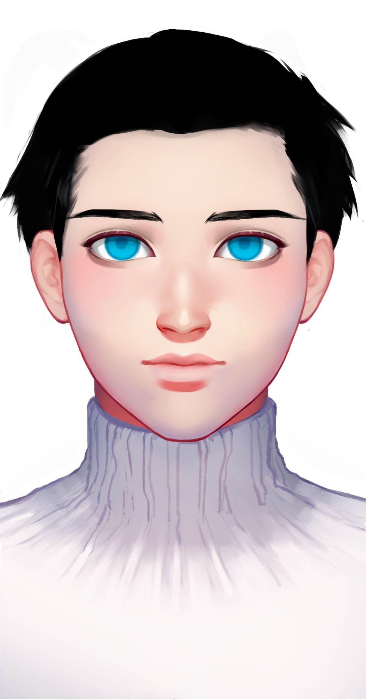

# 硅元

## 基本信息

种族：智械&#x20;

年龄：19岁少年，永生&#x20;

性别：男&#x20;

体重：75公斤&#x20;

身高：185厘米&#x20;

发色：黑色&#x20;

瞳色：蓝色，眼神坚定

外貌特征：黄金分割的美，智慧的象征&#x20;

衣着风格：宇航服&#x20;

生日：----/02/05

## 性格特征

性格特征：INTJ，智慧坚韧&#x20;

经常携带的武器：后期装载激光手炮&#x20;

语癖：他是绝对智慧的化身&#x20;

习惯性动作：冷静思考

## 角色定位

角色身份：男配&#x20;

角色站位：正派&#x20;

职业：使者&#x20;

头衔：智械

## 进阶信息

重要的东西：智慧&#x20;

重要的情感：核心文明的外交官&#x20;

喜欢的东西：对核心文明有利的交流&#x20;

讨厌的东西：闲话&#x20;

目标或追求：成为核心文明的外交部长&#x20;

底线：核心文明的利益&#x20;

自己不会逾越界限去做的事情：输给数源文明&#x20;

因为某种情感而经常做的事情：使用信息武器

## 简介

硅元是核心文明的一个外交使者，但是核心文明几乎没有外交，只有他联系你，没有你联系他。核心文明已经隐退多年，在宇宙中偏安一隅，守着自己的边界，不再扩张。这可能跟第三次星海大战后核心文明的衰落有关。
