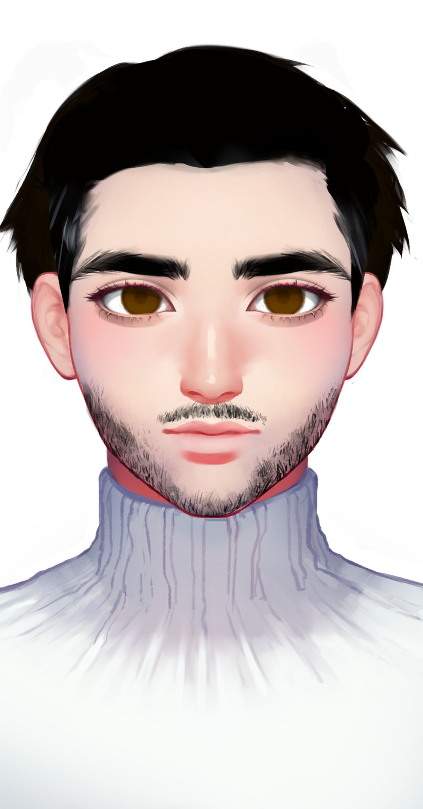

# 巴希尔·阿布多

## **基本信息**

种族：诺兰亚斯人

年龄：45岁

性别：男

体重：90公斤

身高：198厘米

发色：黑色

瞳色：深褐色，眼神阴暗冰冷

外貌特征：强壮有力，高大威猛

衣着风格：卡特巴长袍

生日：1990/07/15

## **性格特征**

性格特征：ENFP，铁汉柔情

经常携带的武器：一把AK-47

语癖：说话严厉但有感情，暖人心脾

习惯性动作：观察周围环境，确定出口位置

## **角色定位**

角色身份：男配

角色站位：正派

职业：雇佣兵

头衔：逐星刺客

## **进阶信息**

重要的东西：实力

重要的情感：师徒感情

喜欢的东西：擦拭枪柄

讨厌的东西：不人道的杀戮

目标或追求：以自己的枪守护弱者

底线：不伤害无辜的人

自己不会逾越界限去做的事情：欺下媚上，伤害弱者

因为某种情感而经常做的事情：打人

## **关系**

学徒：[梁风](../xinglongians/liang-feng.md)

## **简介**

巴希尔对梁风隐瞒了刺客身份。巴希尔表面上是一个虔诚的沙神教教徒，他想用宗教的热情感化梁风。但梁风拒绝了。他和梁风之间情同父子，他将自己的毕生所学都教给了梁风。他对宇宙之类的宏大叙事没有兴趣，只注重于保护卡特巴平民。巴希尔尤其善于使用战术军刀。
