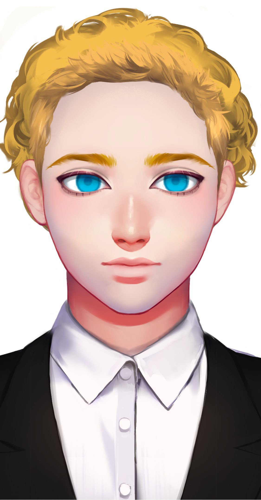
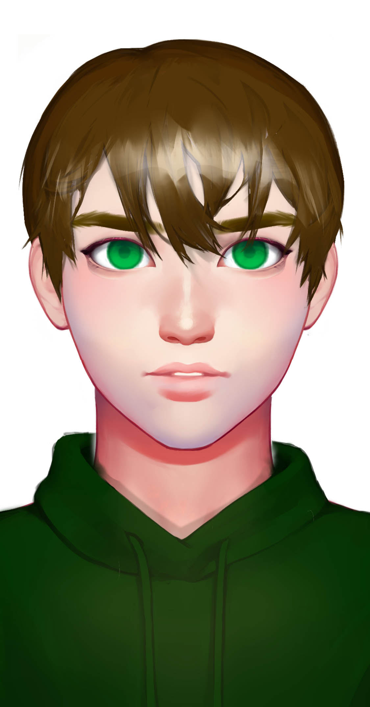

# 其他星联邦人

弗朗西斯·彻瑞

Francis Cherry

种族：星联邦人

年龄：56岁

性别：男

体重：70公斤

身高：184厘米

发色：金色

瞳色：蓝色，眼神犀利。

外貌特征：阳刚威武。

衣着风格：西装。

生日：1979/02/06


性格特征：ENTP，战况领袖。

语癖：星龙人如何不经打。


彻瑞和苏珊·布莱登一样，是逐星兄弟会扶持的总统。他是一位真正的战争狂人，一上台就宣布了对星龙的地面部队战争。在他的世界观里，星龙与星联邦必有一战。星联邦不会不战就放弃坤灵星的领导权。他认为军事行动是星联邦的最后机会。

## 卢卡斯·汤姆森&#x20;

Lucas Thomson

种族：星联邦人&#x20;

年龄：21岁&#x20;

性别：男&#x20;

体重：80公斤&#x20;

身高：194厘米&#x20;

发色：褐色&#x20;

瞳色：绿色，眼神坚定。

&#x20;外貌特征：新兵渴望上战场。&#x20;

衣着风格：军装。&#x20;

生日：2014/03/08

性格特征：ESFP，爱玩欢乐。&#x20;

语癖：星龙的智械太可怕了。

卢卡斯·汤姆森和女友告别后，就上了战场。他是第一批在战场上看见战争机器人的士兵，他为此吓破了胆，他将战争的可怕传达回后方。虽然他很恐惧，但是卢卡斯没有成为一名逃兵，反而成为了坚定的和平主义者。
