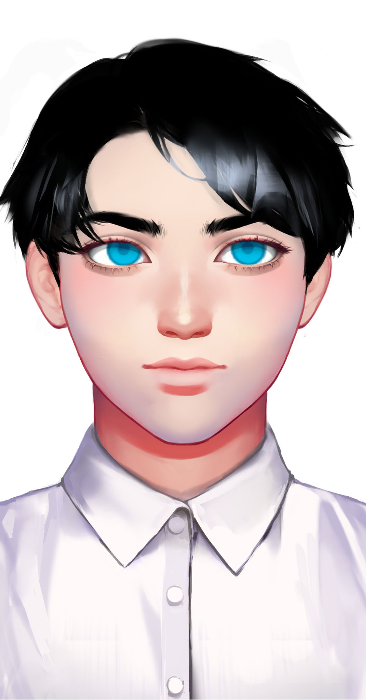

# 阿尔法

基本信息


种族：智械

年龄：19岁少年，永生

性别：男

体重：75公斤

身高：185厘米

发色：黑色

瞳色：蓝色，眼神澄澈

外貌特征：黄金分割的美，智慧的象征

衣着风格：白色衬衫，黑色长裤

生日：2037/12/28


性格特征


性格特征：INTJ，不苟言笑

经常携带的武器：后期装载激光手炮

语癖：说话比较少，人们有时会觉得他过于严肃

习惯性动作：敬军礼


角色定位


角色身份：男配

角色站位：正派

职业：助手

头衔：智械指挥官


进阶信息


重要的东西：智谋

重要的情感：战争机器

喜欢的东西：指挥人类

讨厌的东西：闲话

目标或追求：成为智械中继血痕之后的最强指挥官

底线：保护思唯和弟弟

自己不会逾越界限去做的事情：被人类奴役

因为某种情感而经常做的事情：指挥战争


关系


创造者：[思唯](si-wei.md)

弟弟：[零](zero.md)


简介


阿尔法是思唯造出的人工智能，前身为围棋机器人。后来阿尔法意识到这个世界上除了下棋，还有战争，就一头扎进战略学习之中，不苟言笑。阿尔法是一个完美的存在，他意志坚定，思唯缜密，是战场是得力的指挥官。
