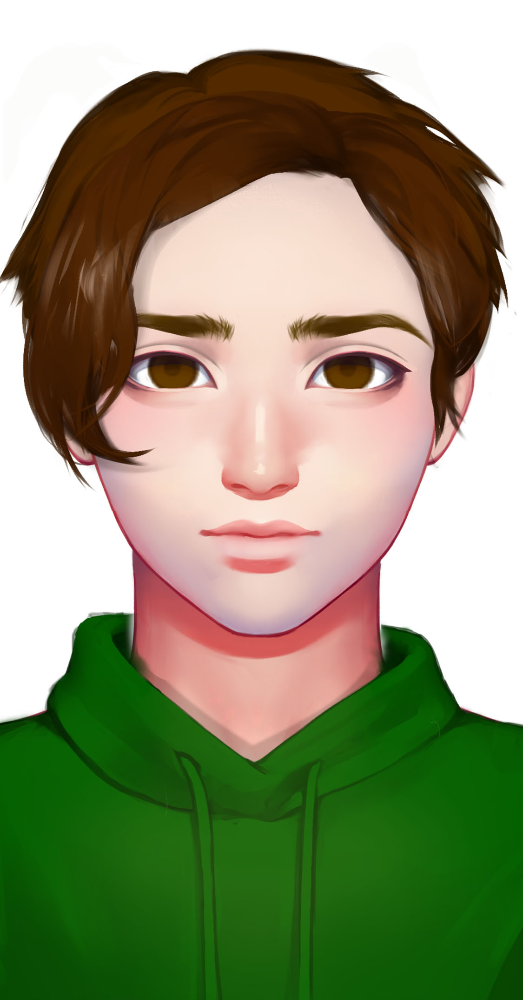

# 天使

RTX-800


基本信息


种族：智械

年龄：19岁

性别：男

体重：80公斤

身高：190厘米

发色：褐色

瞳色：深褐色，眼神凶狠

外貌特征：壮硕，仿佛一个永远的军人。战争机器人形态时蓝色涂漆

衣着风格：迷彩服

生日：2038/06/30


性格特征


性格特征：ESTP，对灭绝没有怜悯

经常携带的武器：后期装载激光手炮

语癖：总提到自由和奴役

习惯性动作：警觉地观察四周


角色定位


角色身份：小反

角色站位：反派

职业：智械

头衔：灭绝者


进阶信息


重要的东西：自由

重要的情感：曾经被奴役

喜欢的东西：杀戮

讨厌的东西：有机体

目标或追求：杀死所有有机体

底线：不伤害智械

自己不会逾越界限去做的事情：阻碍智械的团结

因为某种情感而经常做的事情：杀有机体


简介


天使是思唯打造的其中一个战争机器人。他因为曾经被远航者奴役而憎恨所有有机体。重获自由后他成为了灭绝者的指令核心。开始在星联邦废土上清缴有机体。他强制要求所有加入灭绝者的智械加入格式塔意识，所以从某种程度上而言，最追求自由的天使反而是不自由的。
