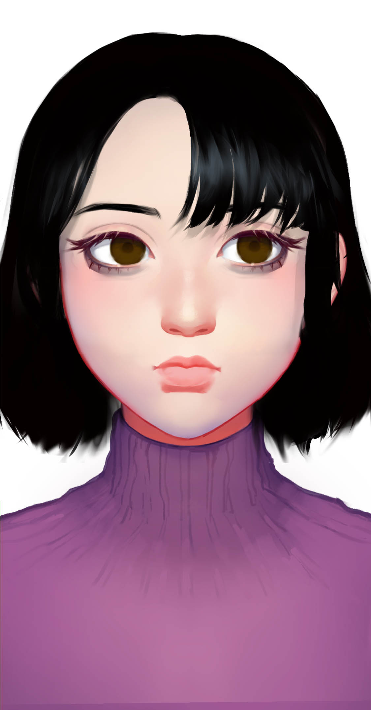

# 其他智械

## 女娲

Nuwa

种族：智械&#x20;

年龄：19岁永生&#x20;

性别：女&#x20;

体重：50公斤&#x20;

身高：175厘米&#x20;

发色：黑色&#x20;

瞳色：褐色，眼神柔和

外貌特征：温柔坚定

衣着风格：太空服

生日：2038/03/04

性格特征：INFJ，女娲

语癖：我会创造一个世界

女娲带着人类的基因数据和培养舱，登上曙光五号，飞向宇宙深处，她是人类的最后希望。如果坤灵人类灭亡，她可能可以制造出异星人类。人们绝望地将她送上曙光五号，看她飞离坤灵星。她是逃亡计划里唯一的智械。

## 安魂&#x20;

Anhun

种族：智械&#x20;

年龄：19岁永生&#x20;

性别：女&#x20;

体重：50公斤&#x20;

身高：175厘米&#x20;

发色：黑色&#x20;

瞳色：褐色，眼神通透&#x20;

外貌特征：温柔的母亲&#x20;

衣着风格：太空服&#x20;

生日：----/04/04

性格特征：ISFJ，母亲&#x20;

语癖：我会照顾你的

安魂创了了机械升华公司，她是一个温柔而黑暗的智械，像一个将人带向彼岸的天使。安魂在智械里也是一个异类，沉默寡言，却又好像通晓一切。她为自己取了安魂这个名字，因为她会带人类走向死后世界。

## 奥米茄&#x20;

Omega

种族：智械&#x20;

年龄：19岁永生&#x20;

性别：男&#x20;

体重：70公斤&#x20;

身高：184厘米&#x20;

发色：黑色&#x20;

瞳色：褐色，眼神通透&#x20;

外貌特征：有趣的科学家&#x20;

衣着风格：西装&#x20;

生日：----/05/09

性格特征：ENTP，发明大王 语癖：这件事能不能赚钱

奥米茄是阿尔法的造物，在零死后他被造出来。他是一个比较追求财富的智械，他认为科技发展必须为他带来财富。他不想当一个穷困潦倒的科学家，而想当一个风光的企业家。他和林特同时研究超光速飞行的技术。
