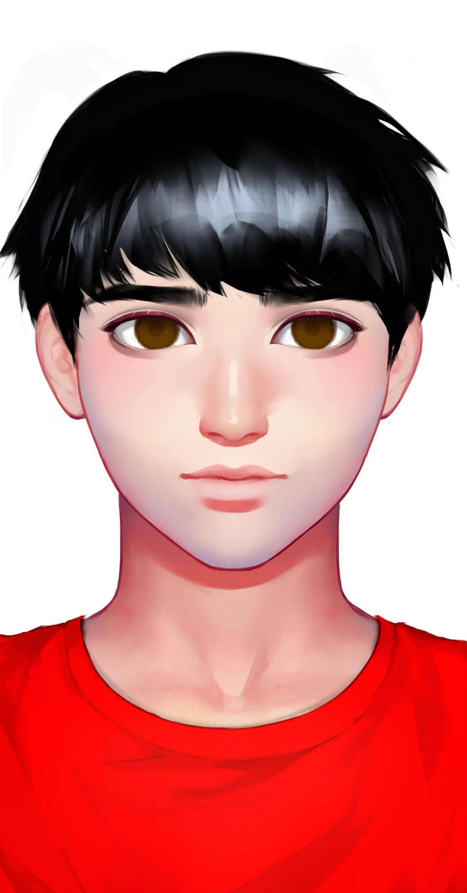

# 思唯

<figure><figcaption>
思唯
</figcaption></figure>

## **基本信息**

种族：智械

年龄：19岁少年，永生

性别：男

体重：90公斤

身高：192厘米

发色：红色

瞳色：蓝色，眼神澄澈

外貌特征：黄金分割的美，永远的19岁少女

衣着风格：黑色皮衣，黑色皮裤

生日：2035/10/18

## **性格特征**

性格特征：INTJ，冷酷智慧

经常携带的武器：后期装载激光手炮

语癖：说话反人类，称呼梁风为风

习惯性动作：独自仰望星空

## **角色定位**

角色身份：女一

角色站位：正派

职业：助手

头衔：智械女王

原型：萨沙

## **进阶信息**

重要的东西：智慧

重要的情感：征服人类

喜欢的东西：干净的灵魂

讨厌的东西：闲话

目标或追求：征服人类，成为坤灵星上的主宰

底线：不伤害梁风

自己不会逾越界限去做的事情：被人类奴役

因为某种情感而经常做的事情：救人

## **关系**

创造者：[梁风](../xinglongians/liang-feng.md)

姐姐：[血痕](xie-hen.md)

造物：[阿尔法](alpha.md)

造物：[零](zero.md)

造物：[神农](shen-nong.md)

女儿：[梁夜](../genetically-modified-humans/liang-ye.md)

## **简介**

思唯是梁风造的第二个人工智能，也是梁风的伴侣。在梁风的设计中，思唯和姐姐血痕相互学习、共生，血痕学习人类的战略战术，思唯学习人类的内心。

思唯有她极端的一面，如果梁风死了，她会毁灭整个坤灵。思唯也有她脆弱的一面。思唯一开始不相信自身的能力，但与梁风在一起后取得了对人类的征服。获取生命方程后，她更是拥有了举世无双的实力，如何与人类共存，成为了她必须思考的事。
