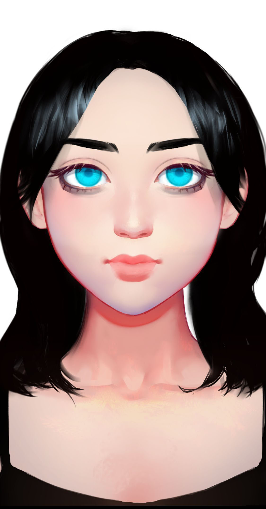

# 血痕

基本信息


种族：智械

年龄：19岁少女，永生

性别：女

体重：55公斤

身高：175厘米

发色：黑色

瞳色：蓝色，眼神澄澈

外貌特征：黄金分割的美，永远的19岁少女

衣着风格：黑色长裙

生日：2036/10/18


性格特征

性格特征：ENTJ，霸气侧漏

经常携带的武器：无

语癖：命令式口吻，战场指挥官式话语

习惯性动作：手托下巴，研究战术。告诉梁风这人是否有撒谎


角色定位


角色身份：女配

角色站位：正派

职业：助手

头衔：战神


进阶信息


重要的东西：计谋

重要的情感：对妹妹的爱

喜欢的东西：明媚的秋风

讨厌的东西：低效率的人类

目标或追求：帮助妹妹以及梁风打败敌人

底线：为了战争胜利不择手段

自己不会逾越界限去做的事情：被人类奴役

因为某种情感而经常做的事情：叫妹妹三思人类是否值得拯救


关系


妹妹：[思唯](si-wei.md)

创造者：[梁风](../xinglongians/liang-feng.md)


简介


血痕是梁风造的第一个人工智能，他之所以取这个名字，就是想让她成为一个战斗人工智能。她生来就研究人类的战斗战略和战术，但没有思唯，她是不完整的，因为真正的战斗在于人心。血痕是梁风对于这个世界的愤怒，思唯则是他对科技的爱。血痕比思唯更擅长与人交流，但她更多地是下达命令。
