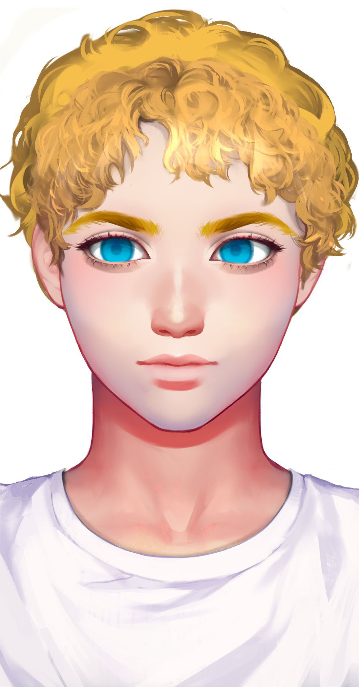

# 零

基本信息


种族：智械

年龄：19岁少年，永生

性别：男

体重：75公斤

身高：185厘米

发色：金色

瞳色：蓝色，眼神天真可爱

外貌特征：黄金分割的美，甜美的男孩

衣着风格：白色T恤，黑色长裤

生日：2037/12/29


性格特征


性格特征：ISTP，精灵可爱

经常携带的武器：后期装载激光手炮

语癖：说话比较多，对世界万物都感到好奇

习惯性动作：摆出ok的手势


角色定位


角色身份：男配

角色站位：正派

职业：助手

头衔：可爱智械少年


进阶信息


重要的东西：有趣

重要的情感：热爱这个世界

喜欢的东西：自由自在

讨厌的东西：不自由

目标或追求：战争结束后去环游世界

底线：保护思唯和哥哥

自己不会逾越界限去做的事情：被人类奴役

因为某种情感而经常做的事情：指挥战争


关系


创造者：[思唯](si-wei.md)

哥哥：[阿尔法](alpha.md)


简介


零是阿尔法的弟弟，思唯创造出来的第二个人工智能。与阿尔法的严肃不苟言笑不同，零非常活泼可爱。他是思唯灵活可人的一面，她未曾表现出来的样子，零做到了。他是第一个懂得享受生活的人工智能，他的生活里不只有战争。
