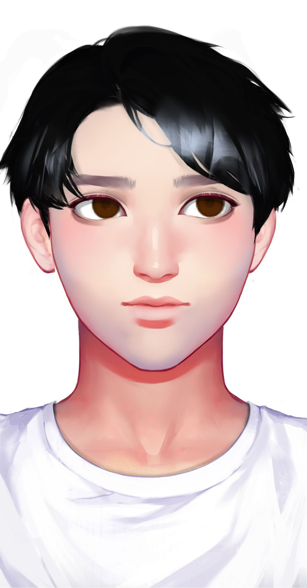

# 江致远

基本信息


种族：星龙人

年龄：23岁

性别：男

体重：70公斤

身高：188厘米

发色：黑色

瞳色：深褐色，眼神干净清爽

外貌特征：亦正亦邪的帅哥

衣着风格：白色T恤，牛仔裤

生日：2012/11/15


性格特征


性格特征：INTP，冷静旁观

经常携带的武器：键盘

语癖：说话非常有逻辑，但话很少，内心世界丰富

习惯性动作：隐秘在常人之间


角色定位


角色身份：男配

角色站位：正派

职业：码者

头衔：灰帽黑客


进阶信息


重要的东西：学识

重要的情感：与梁风的友谊

喜欢的东西：研究黑客技术

讨厌的东西：浪费时间

目标或追求：证明自己的黑客实力

底线：不伤害无辜的人

自己不会逾越界限去做的事情：欺下媚上，伤害弱者

因为某种情感而经常做的事情：黑进不该黑的系统


简介


江致远游走在黑白之际，是一个灰帽黑客，简称灰客，代号旁观者（Bystander）。他曾是一个独行侠，专研个人技术，达到个人目的，直到他遇到了梁风。梁风坚定狂热的个性吸引了他，两人遂成为好友。平时不爱说话的江致远也打开了话匣子。
