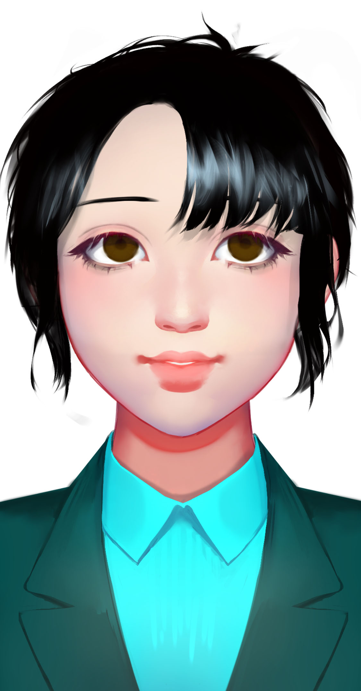

# 宁海

## 基本信息


种族：星龙人

年龄：28岁

性别：女

体重：52公斤

身高：165厘米

发色：黑色

瞳色：深褐色，眼神犀利。

外貌特征：黑色短发被风吹乱。

衣着风格：浅蓝色西装。

生日：2007/08/14

## 
性格特征


性格特征：ISFJ，美好传统。

经常携带的武器：无。

语癖：追根问底，言辞犀利，人文关怀。

习惯性动作：用手去拨被风吹乱的头发。

## 
角色定位


角色身份：女配

角色站位：正派

职业：记者

头衔：专栏作家

## 
进阶信息


重要的东西：人文关怀

重要的情感：对新闻事业的爱。

喜欢的东西：犀利采访。

讨厌的东西：无可奉告。

目标或追求：做有态度的新闻。

底线：不报道假新闻。

自己不会逾越界限去做的事情：不实报道。

因为某种情感而经常做的事情：反对码者。

## 
简介


宁海是个对科技对未知感到恐惧的人。认为如果人文伦理跟不上，那么科技的飞速发展必然使人理混乱。还认为人类很可能点歪了科技树。她花了很长时间去跟踪采访那些被科技伤害了的人们，甚至采访过失去母亲的梁风。宁海甚至认为科技是外星人用来控制人类的东西。

