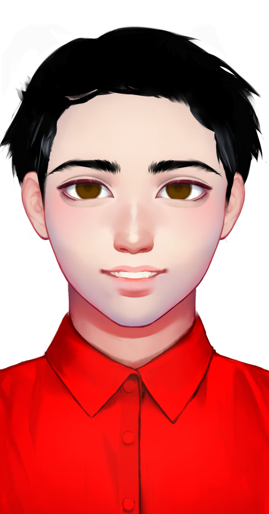
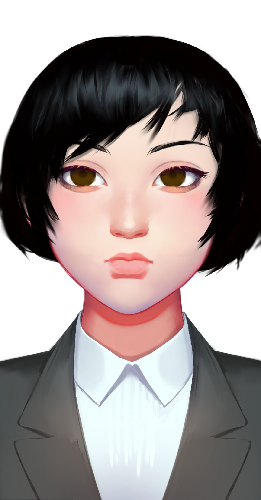
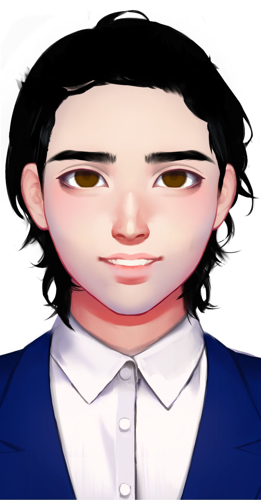
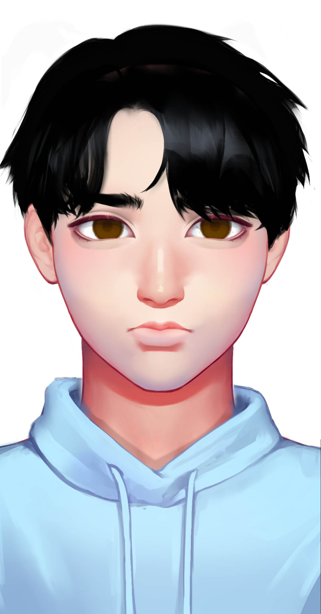
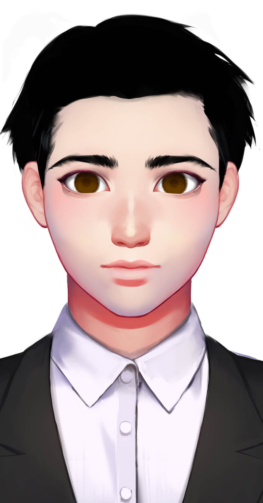

# 其他星龙人

## 梁睿

Liang Rui

种族：星龙人

年龄：47岁

性别：男

体重：70公斤

身高：186厘米

发色：黑色

瞳色：深褐色，眼神和善

外貌特征：码者的一般装束

衣着风格：红色格子衫

生日：1988/05/01

性格特征：ISFP，和善灵动

语癖：慈祥的老父亲

梁睿是梁风的父亲，冬梅的丈夫。他的代码实力远在妻子之下，但他是一个自由码者，靠着接人工智能的单子来帮补家用。由于家中的计算机性能不足，他经常在最后的键盘码吧里工作到深夜，跑着各种人工智能模型。

## 冬梅

Dong mei

种族：星龙人

年龄：47岁

性别：女

体重：50公斤

身高：168厘米

发色：黑色

瞳色：深褐色，眼神犀利

外貌特征：波浪长发，坚毅美丽

衣着风格：黑色裙装

生日：1988/06/14

性格特征：INTJ，极其天才

语癖：工作是她的一切，专业是她的语言

冬梅是梁风的母亲，梁风的天才继承于她的智商。她在星龙国最大的网络公司云龙集团当架构师，也是码者联盟里的导师。她平时很少关心梁风，总是将时间都放在工作上。所以梁风更多花时间与父亲在一起，得不到母亲的注意。

## 欧阳逸

Ou Yangyi

种族：星龙人

年龄：35岁

性别：男

体重：70公斤

身高：182厘米

发色：黑色

瞳色：深褐色，眼神凶狠

外貌特征：码者的一般装束

衣着风格：白色衬衫，黑色皮裤

生日：2000/06/17

性格特征：ESFP，冲动好斗

语癖：表演型人格，三句不离大众

欧阳逸是一个失败的码者，他的水平没有超过码奴级，根本不适合当一个码者。于是他在35岁的那年被辞退，再也找不到工作。自动化取代了他这种底层码者的工作。他因此愤而加入破码者极端组织，仇恨并攻击码者。

程德义

Cheng Deyi


种族：星龙人

年龄：42岁

性别：男

体重：70公斤

身高：178厘米

发色：黑色

瞳色：深褐色，眼神坚毅

外貌特征：西装革履，戴眼镜

衣着风格：黑色西装

生日：1993/07/09


性格特征：ESTP，为达目的不择手段

语癖：科技是他的一切


程德义是一个著名的工程师，他发明了记忆删除机，是芯脑科技的CEO。对他而言，芯脑科技是他的一切，他绝对无法割舍。他不顾记忆删除可能引起的伦理争议，将这项服务推广到千家万户，因此被键客盯上。

云希月

Yun Xiyue


种族：星龙人

年龄：36岁

性别：女

体重：50公斤

身高：165厘米

发色：黑色

瞳色：深褐色，眼神柔和

外貌特征：波浪短发，坚毅美丽

衣着风格：黑色西装

生日：1999/08/15


性格特征：ISTP，感受这个世界的潮流

语癖：没有最好的冷冻人，只有最好的冷冻技术


云希月是兰斯冷冻的星龙区CEO，她是一个公关能手，无论兰斯冷冻出现什么负面新闻，她都能拯救它的形象。她认为自己只是一个职业经理人，兰斯冷冻的运作模式按照的是总部的规则，她不能改动。

傅星海

Fu Xinghai


种族：星龙人

年龄：38岁

性别：男

体重：70公斤

身高：182厘米

发色：黑色

瞳色：深褐色，眼神戏谑

外貌特征：非常有魅力的脸庞

衣着风格：深蓝色西装

生日：1997/09/02


性格特征：ENFJ，以情动人

语癖：无限人生就是他的活法


傅星海是无限人生的CEO，和他创造的虚拟世界一样，他是一个爱玩，有趣有生活的人。他认为虚拟世界应该是丰富多彩的，充满社交和刺激的。他喜欢到酒吧喝酒，并不沉迷于无限人生，因为他在现实中不是一个卢瑟。他经常叫别人不要沉迷于无限人生。

凯超

Kai Chao


种族：星龙人

年龄：32岁

性别：男

体重：70公斤

身高：185厘米

发色：金色

瞳色：深褐色，眼神深邃

外貌特征：非常有魅力的脸庞

衣着风格：蓝色衬衫

生日：2003/10/03


性格特征：ESFJ，社会伦理

语癖：守护这个世界的秩序


凯超是凯欣的哥哥，也参与了反研究危险科技协会，他是一个化学家，为一家化工材料公司工作。他希望成为上中产阶级，对生活品质有追求。他是技术大停滞的极端支持者，甚至放弃了他的化学家工作，成为职业的演讲家，这让他收入上升了。

晚风

Wan Feng

种族：星龙人

年龄：26岁

性别：女

体重：53公斤

身高：175厘米

发色：黑色

瞳色：深褐色，眼神阴冷

外貌特征：黑色短发，神秘悠远

衣着风格：黑色吊带衣

生日：2009/11/06


性格特征：INFP，与这个世界的集体无意识联结

语癖：我的剑刃所指之处，就是我的归途


晚风是逐风兄弟会的刺客。她非常神秘，连真名也没有。她是逐风兄弟会在天璇市的代理人，她的脸代表了兄弟会的脸，虽然她只是一个低阶的刺客。晚风从小被训练成刺客，导致她其实社恐，她内心深处对正常生活其实是有渴望的。

许澜

Xu Lan

种族：星龙人

年龄：32岁

性别：女

体重：55公斤

身高：158厘米

发色：黑色

瞳色：深褐色，眼神深邃

外貌特征：黑色长发，朴素低调

衣着风格：黑色皮衣

生日：2003/12/01


性格特征：INTJ，但较为神经质

语癖：智械崇拜者


许澜认为智械是降临到这个世界上最美好的事物。她创立了人类智械同盟。她本人是一个忍者码者，创造过一种编程语言叫Dove。她认为智械就是神，而她崇拜这样绝对全能、公正、善良的神明。梁风对她这种对智械的崇拜不置可否。

万英哲

Wan Yingzhe


种族：星龙人

年龄：33岁

性别：男

体重：70公斤

身高：184厘米

发色：黑色

瞳色：深褐色，眼神和善

外貌特征：正派有气质

衣着风格：白色衬衫

生日：2002/01/04


性格特征：ESTJ，领导气质

语癖：人类文明如何如何


万英哲创立了反人工智能阵线，他收星联邦的钱来反人工智能。星联邦保证如果事情败露，会保他去星联邦或者卡维亚。他精明会算计，用反人工智能来增强自己的影响力，是一个天生的政治家。巡回整个星龙进行反人工智能演讲。

## 江渔儿

Jiang Yuer

种族：星龙人

年龄：22岁&#x20;

性别：男&#x20;

体重：70公斤&#x20;

身高：175厘米&#x20;

发色：黑色&#x20;

瞳色：深褐色，精灵可爱

外貌特征：有朝气的年轻人&#x20;

衣着风格：渔夫的衣服

生日：2013/02/09

性格特征：ISFP，灵动可爱。 语癖：你要吃我做的鱼吗

江渔儿住在五车附近的渔村，以捕鱼为生。有一天，他遇到了即将沉没的大航海家号，他把破浪隐藏在自己家里，还教给远航者们人类的文化。他希望人类与远航者和平共处，但他不知道破浪在接触互联网后，心中最看不起的就是慕强又傲慢的人类。

## 柯奇略&#x20;

Ke Qilue

种族：星龙人

年龄：37岁&#x20;

性别：男&#x20;

体重：75公斤&#x20;

身高：187厘米&#x20;

发色：黑色&#x20;

瞳色：深褐色，雄才大略&#x20;

外貌特征：自信的风险投资人&#x20;

衣着风格：西装&#x20;

生日：----/03/15

性格特征：INTJ，自信逼人&#x20;

语癖：我有钱

柯奇略资助了整个星龙文艺复兴，他是一个极其自信的风险投资人。他曾经想成为一个艺术家，但失败了。后来他意识到，只有和科技结合在一起的艺术，才是当今世界上的艺术。他不只资助人类，也资助智械和改造人艺术家。

## 殷婉仪&#x20;

Yin Wanyi

种族：星龙人&#x20;

年龄：41岁&#x20;

性别：女&#x20;

体重：50公斤&#x20;

身高：168厘米&#x20;

发色：黑色&#x20;

瞳色：深褐色，坚定&#x20;

外貌特征：自信的指挥官&#x20;

衣着风格：太空服&#x20;

生日：----/04/18

性格特征：ESTJ，自信逼人&#x20;

语癖：群星是我们的未来

殷婉仪是星龙血云星首席指挥官。她深谙指挥的艺术，也具有开拓者的冒险天性。她全程指挥星龙在血云星上的城市建设和开发。柯奇略曾经要以大量钱财资助血云星的开发，但殷婉仪拒绝了，她认为自己是星龙政府的公仆而不是商人的傀儡。
