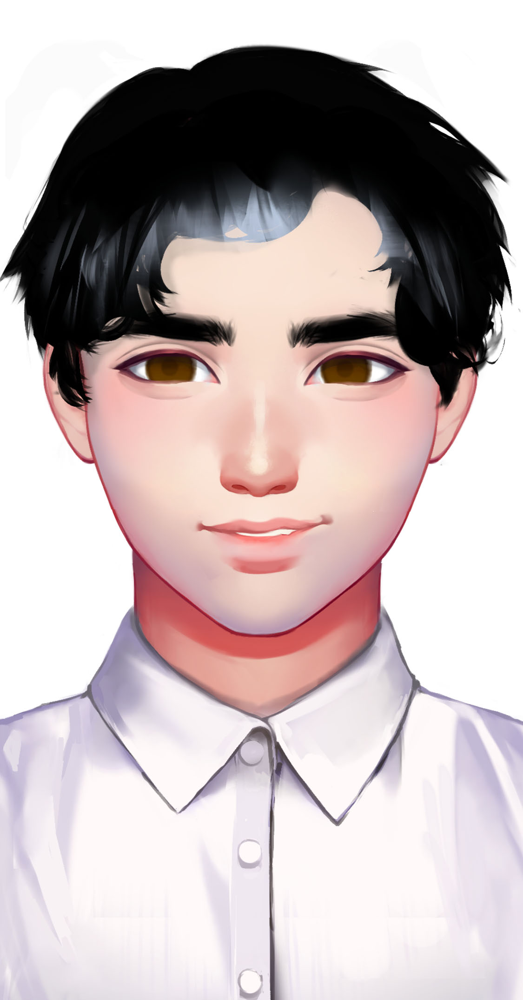

# 其他星龙人

## 梁睿

Liang Rui

种族：星龙人

年龄：47岁

性别：男

体重：70公斤

身高：186厘米

发色：黑色

瞳色：深褐色，眼神和善。

外貌特征：码者的一般装束。

衣着风格：红色格子衫。

生日：1988/05/01

性格特征：ISFP，和善灵动。

语癖：慈祥的老父亲。

梁睿是梁风的父亲，冬梅的丈夫。他的代码实力远在妻子之下，但他是一个自由码者，靠着接人工智能的单子来帮补家用。由于家中的计算机性能不足，他经常在最后的键盘码吧里工作到深夜，跑着各种人工智能模型。

## 冬梅

Dong mei

种族：星龙人

年龄：47岁

性别：女

体重：50公斤

身高：168厘米

发色：黑色

瞳色：深褐色，眼神犀利。

外貌特征：波浪长发，坚毅美丽。

衣着风格：黑色裙装。

生日：1988/06/14

性格特征：INTJ，极其天才。

语癖：工作是她的一切，专业是她的语言。

冬梅是梁风的母亲，梁风的天才继承于她的智商。她在星龙国最大的网络公司云龙集团当架构师，也是码者联盟里的导师。她平时很少关心梁风，总是将时间都放在工作上。所以梁风更多花时间与父亲在一起，得不到母亲的注意。

## 欧阳逸

Ou Yangyi

种族：星龙人

年龄：35岁

性别：男

体重：70公斤

身高：182厘米

发色：黑色

瞳色：深褐色，眼神凶狠。

外貌特征：码者的一般装束。

衣着风格：白色衬衫，黑色皮裤。

生日：2000/06/17

性格特征：ESFP，冲动好斗。

语癖：表演型人格，三句不离大众。

欧阳逸是一个失败的码者，他的水平没有超过码奴级，根本不适合当一个码者。于是他在35岁的那年被辞退，再也找不到工作。自动化取代了他这种底层码者的工作。他因此愤而加入破码者极端组织，仇恨并攻击码者。

