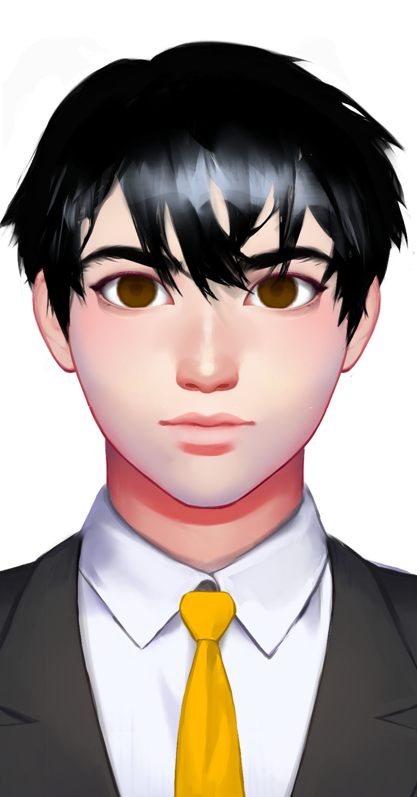

# 云飞

基本信息


种族：星龙人

年龄：45岁

性别：男

体重：65公斤

身高：178厘米

发色：黑色

瞳色：深褐色，眼神灵动。

外貌特征：瘦削，不拘一格。

衣着风格：黑色西装，橙色领带。

生日：1990/01/06


性格特征


性格特征：ENFP，阳光灵活。

经常携带的武器：无。

语癖：说话滔滔不绝，一句话不离价值观和文化。

习惯性动作：到位的演讲手势。


角色定位


角色身份：小反

角色站位：反派

职业：商人

头衔：云龙的CEO


进阶信息


重要的东西：价值观

重要的情感：对世界的美好的追求。

喜欢的东西：演讲，开会，传达价值观。

讨厌的东西：死板的人生

目标或追求：把云龙开成百年公司。

底线：不作恶是科技公司的底线。

自己不会逾越界限去做的事情：写代码。

因为某种情感而经常做的事情：以价值观开除人。


简介


云飞是一个只开发卖菜等系统的内卷企业家，说九点上班九点下班，一周工作六天是人的幸运。多菜商城（Duocai Mall）就是云龙科技的拳头产品之一。云飞曾是一个很有梦想的人，把互联网带进星龙，是互联网的先驱。他开发出龙讯（Longxun）社交网络成名，后来欺压小科技公司，抄袭或者购买之后使其消亡。他是一个星龙式的企业家。但他不是一个工程师，只有价值观没有科技理想。但他是喜欢梁风这样的科技天才的，他说自己的工作就是将天才聚合在一起。
