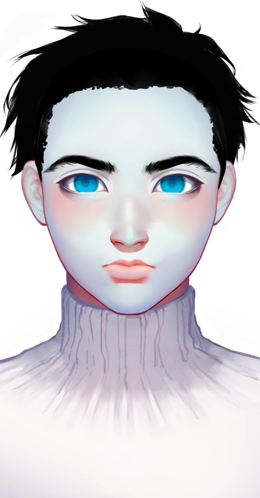

# 桅帆

## 基本信息

种族：远航者&#x20;

年龄：45岁&#x20;

性别：男&#x20;

体重：90公斤&#x20;

身高：200厘米&#x20;

发色：黑色&#x20;

瞳色：冰蓝色，眼神充满杀气。&#x20;

外貌特征：美型，永远的19岁，淡蓝色皮肤。&#x20;

衣着风格：银色外星宇航服。 生日：1990/04/28

## 性格特征

性格特征：ENTJ，绝对的将军。&#x20;

经常携带的武器：激光步枪。&#x20;

语癖：依仗远航者的军事实力。&#x20;

习惯性动作：居高临下地蔑视人类。

## 角色定位

角色身份：小反&#x20;

角色站位：反派&#x20;

职业：将军&#x20;

头衔：远航上将&#x20;

## 进阶信息

重要的东西：远航星的存续&#x20;

重要的情感：消灭劣等种族&#x20;

喜欢的东西：战争&#x20;

讨厌的东西：有人抗命&#x20;

目标或追求：我远航者打下坤灵星&#x20;

底线：不背叛远航者的理想&#x20;

自己不会逾越界限去做的事情：忘记远航的目的&#x20;

因为某种情感而经常做的事情：屠杀人类

## 简介

桅帆从小展示了极佳的战争天赋，一路在远航星的军事学院读上来，镇压过风帆难民的暴动。最擅长打烈度低的大国与小国的战争。远航者们认为与坤灵的一战将是绝对的高阶文明清除低阶文明，桅帆认为他们能在3年内解决战斗，结果打了10年。
