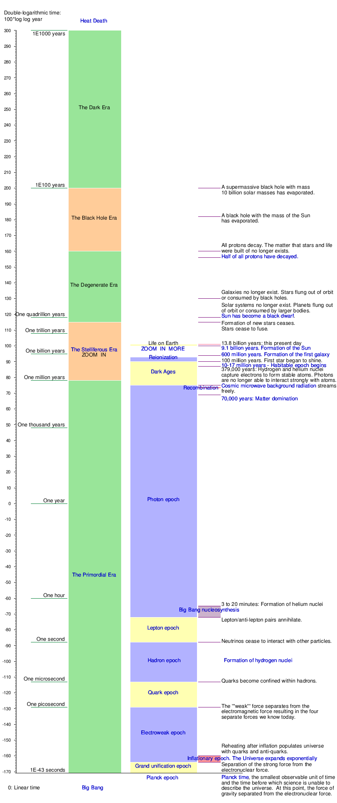
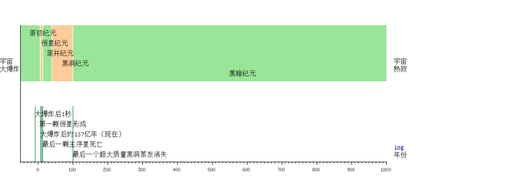

# 计算宇宙历法

## 计算宇宙文明纪年法

在计算宇宙中存在多种纪年法。

### 计算纪年法

计算纪元

0年，数源文明：数源文明第一次载人航天

182年，数源文明：数源文明发现数源方程（同三态方程）

11988年，星龙文明：星龙文明发现三态方程，等同于星龙纪元2206年

### 星龙纪年法

星龙纪元

第一卷：停滞纪元（1年）2035-2036

第二卷：智械之死（2年）2036-2038

第三卷：远航文明（17年）2038-2055

第四卷：黑暗时代（43年）2055-2098

第五卷：生命方程（50年）2098-2148

第六卷：超越光速（100年）2148-2248

第七、八卷：深入星空、星辰永恒（452年）2248-2700

<figure><figcaption>
宇宙纪年
</figcaption></figure>

<figure><figcaption>
宇宙纪年中文
</figcaption></figure>

## 计算宇宙恒星纪年法

以恒星为跨度的纪元。

### 原初纪

0-4\*10^8年

所谓的原初纪元，也就是宇宙形成之后的第一个纪元。在这个纪元中奇点爆炸形成宇宙的瞬间，导致物质和能量倾泻，许多大质量的恒星开始出现。

因为这些恒星的质量很大，所以内部发生的反应也非常的快速剧烈，这就导致这些大质量恒星通常在几百万年到几千万年内就会“燃烧殆尽”，之后发生爆炸，产生黑洞以及抛射出其它的物质，这些物质在力的作用下组成二代恒星和行星。

### 恒星纪

4\*10^8年至10^10年

《计算宇宙》发生的时间为1.37^10年

奇点爆炸约4亿年之后，宇宙中开始产生大量的二代恒星，标志着宇宙开始开始进入“恒星纪元”，在这个纪元中宇宙被各种恒星所主宰，宇宙开始变得适宜生命活动，我们正是处于这个纪元当中。

那么这个“恒星纪元”会在什么时候结束呢？或者说宇宙中最后一颗恒星会在什么时候“熄灭”呢？我们都知道宇宙中恒星的质量越小，那么它的寿命也就越长，因为质量越小的恒星其核聚变反应中把氢转化为氦的速度越慢。

根据科学家的推测，宇宙中最小的红矮星可以持续1万亿年的时间，这也就意味着在宇宙幼年时形成的红矮星到现在只用了1%左右的氢元素，所以从人类的角度来看，它们还是“婴儿”。

现在，不断运动的星系还在搅拌着星云进而形成新的恒星，但是星云迟早有耗尽的那一天。据估计，在数十亿年之后宇宙中的新生恒星数量就会开始变少，而宇宙中已经形成的恒星大部分将会在几十年后开始走上末路。而此时宇宙中只有那些长命的红矮星还在发着光。

而几万亿年后随着最后一颗红矮星熄灭，宇宙中释放能量的就只剩下白矮星、中子星和黑洞，另外可能还有一些“棕矮星”，此时“恒星纪元”正式结束。

### 简并纪元

从10^10年到10^40年

#### 宇宙加速膨胀：10^10年

宇宙加速膨胀使星系间距离扩大。10^10年内，除了一些有引力联系的星系，其它星系都会因为离开可观测宇宙外而变成不可见。

#### 星系和恒星停止产生：10^14年

在这段时间里，星系和恒星的形成逐渐减缓并完全停止，至于那些仍然存在的恒星，由于自身核燃料的逐渐枯竭，恒星的温度和光度逐渐下降，直到核燃料完全耗尽，恒星死亡为止。当宇宙中所有的恒星都熄灭之后，只有行星、小行星（包括彗星、陨石和棕矮星）、白矮星、黑矮星、中子星、奇异星和黑洞能够继续存在。偶尔，棕矮星之间的相互撞击会形成新的红矮星。这些红矮星会在宇宙中继续存在数十亿年，成为宇宙中为数不多的可见光源。

#### 行星开始脱离轨道：10^15年

由于引力波和引力扰动的影响，1015年后，行星逐渐脱离它们的原始轨道。

#### 恒星开始脱离轨道：10^16年

同样是因为引力波和引力扰动的影响，星系中的恒星和恒星残骸也开始离开它们的原始轨道，只留下分散的恒星残骸以及超大质量黑洞。

#### 质子衰变：10^36年至10^40年

第一个可能性是以某些大一统理论中，质子寿命极长但有限为前提推测的。

#### 一半质子完成衰变：10^36年

根据某些理论认为质子会衰变，而半衰期（10^36年）的估计是正确的话，届时，宇宙中大约一半的物质已经通过质子衰变形式转化为伽马射线和轻子。

#### 全部质子完成衰变：10^40年

这时，所有的质子都已完成衰变。事实上在这种情况下，宇宙中所有的物质只能两种形式存在：黑洞或是轻子。

### 黑洞纪元

从10^40年到10^100年

#### 黑洞占主导地位：10^40年

黑洞继续透过霍金辐射的形式缓慢的蒸发。

#### 黑洞崩溃：10^100年

最后的黑洞预计将在10150年左右蒸发完毕，届时所有残余的黑洞都将被完全蒸发：首先是低质量的黑洞，最后是超大质量黑洞，现在宇宙中所有的物质都已衰变为光子和轻子。所有组成恒星和星系的物质都衰变为光子和轻子。

### 黑暗纪元

10^100年-

在全宇宙最后一个黑洞也因为霍金辐射蒸发消失之后，宇宙将进入黑暗纪元（英语：DarkEra），此时的宇宙中已没有任何宏观尺度的天体存在，只剩下质子衰变之后的轻子和光子等能量极低的亚原子粒子，并且几乎不进行能量交换，也不会发生什么有意义的事件。如果时间还有意义的话，这个纪元将会延续到无穷。

#### 光子时代：10^150年到10^1000年

光子时代中，宇宙内的所有物质均已衰变为光子和轻子。宇宙的熵将在此后继续增大并最终达到热寂状态，温度也将无限趋于绝对零度。

#### 宇宙达到最低能量状态（热寂）：10^1000年

现在，宇宙已经进入低能状态，整个宇宙热平衡，宇宙的熵值将达到最大。宇宙已死。或者说，连死亡都消逝，目前尚不清楚在这之后会发生什么。一种假设是宇宙很可能会永远停留在这种状态，进入真正意义上的热寂状态。意味着量子事件将会取代其他的微观活动成为宇宙的主宰。
