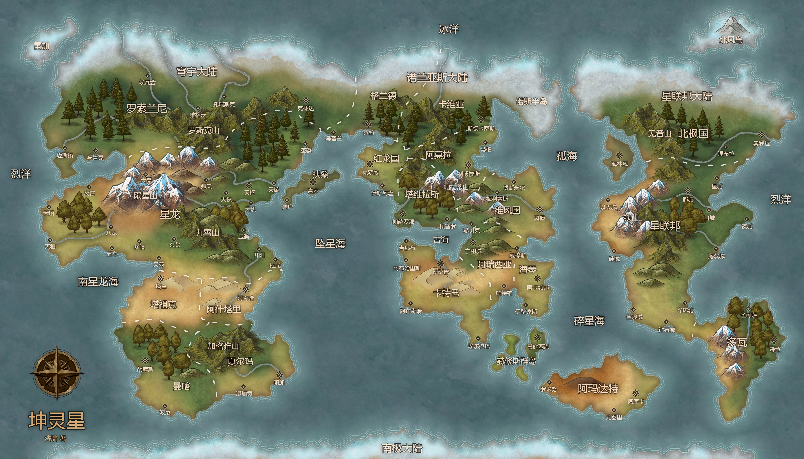
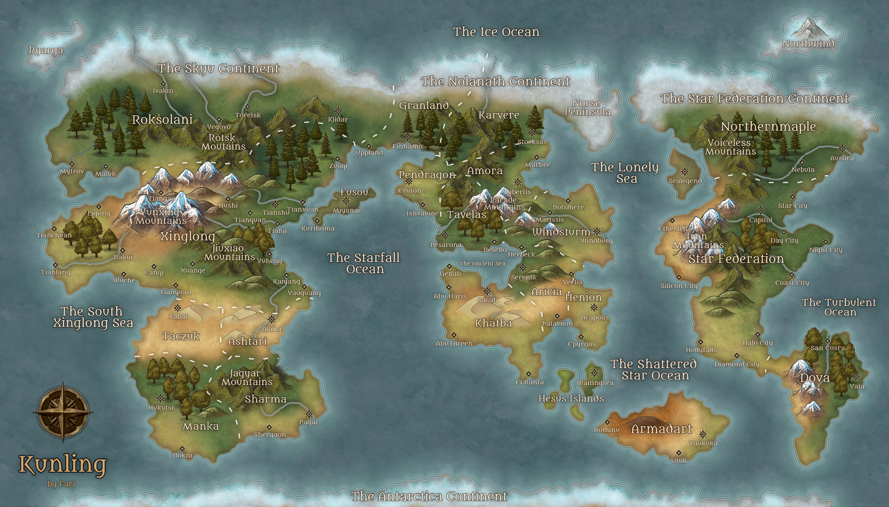

# 坤灵星地图

## 中文地图

## 英文地图

## 坤灵星地图译名对照

Abu Haris 阿布哈里斯（城市）

Abu Qireen 阿布奇瑞（城市）

Acapolis 阿卡城邦（城市）

Akiha 阿奇哈（城市）

Amora 阿莫拉（国家）

Aricia 阿瑞西亚（国家）

Armadart 阿玛达特（国家）

Ashtari 阿什塔里（国家）

Aurora 奥罗拉（城市）

Bakui 八魁（城市）

Besello 贝塞罗（城市）

Bokni 波尼（城市）

Bolsmere 博斯米尔（城市）

Canqi 参旗（城市）

Capitol 都城（城市）

Coast City 海滨城（城市）

Croton 克罗敦（城市）

Day City 日城（城市）

Diamond City 钻石城（城市）

Dova 多瓦（国家）

El Rahta 埃尔拉塔（城市）

Epyrgos 伊壁戈斯（城市）

Etherfell 以太城（城市）

Finhamn 芬翰（城市）

Fusou 扶桑（国家）

Genab 吉那布（城市）

Granland 格兰德（国家）

Halo City 光环城（城市）

Henion 海琴（国家）

Herbeck 赫贝克（城市）

Hesus Islands 赫修斯群岛（国家）

Hollyfalls 圣陨城（城市）

Hukutsi 胡库斯（城市）

Hushi 弧矢（城市）

Iron Mountains 铁山（山脉）

Ishvalone 伊斯瓦隆（城市）

Ivakin 埃瓦金（城市）

Jagyar Mountains 加格雅山（山脉）

Jiuxiao Mountains 九霄山（山脉）

Kaiyang 开阳（城市）

Karvere 卡维亚（国家）

Khatba 卡特巴（国家）

Klidar 克林达（城市）

Kurihoma 栗户（城市）

Libertis 利博提斯（城市）

Ligong 离宫（城市）

Maluk 马鲁克（城市）

Manka 曼喀（国家）

Marbre 马柏（城市）

Marissis 梅利赛斯（城市）

Miyanai 宫内（城市）

Mytrov 迈斯拓（城市）

Nebula 涅布拉（城市）

Night City 夜城（城市）

Norse Peninsula 诺斯半岛（岛屿）

Northernmaple 北枫国（国家）

Northwind 北风岛（岛屿）

Pagat 帕加（城市）

Parade Mountains 帕拉蒂山（山脉）

Patavium 帕特维（城市）

Pendragon 红龙国（国家）

Pesarona 帕萨罗那 （城市）

Planet Kunling 坤灵星（宜居星球）

Roksolani 罗索兰尼（国家）

Rominu 罗米努（城市）

Rotsk Moutains 罗斯克山（山脉）

Ryarga 雷加（岛屿）

San Cosra 圣可萨（城市）

Sasab 沙萨巴（城市）

Sealegend 海林恩（城市）

Serenis 宁和城（城市）

Sharma 夏尔玛（国家）

Shergaon 湿加贡（城市）

Silicon City 硅城（城市）

Star City 星城（城市）

Star Federation 星联邦（国家）

Stocksas 斯德卡萨斯（城市）

Tabat 塔巴（城市）

Taczuk 塔祖克（国家）

Taukuka 陶库卡（城市）

Tavelas 塔维拉斯（国家）

The Ancient Sea 古海（海洋）

The Antarctica Continent 南极大陆（大陆）

The Ice Ocean 冰洋（海洋）

The Lonely Sea 孤海（海洋）

The Nolanath Continent 诺兰亚斯大陆（大陆）

The Shattered Star Ocean 碎星海（海洋）

The Skyu Continent 穹宇大陆（大陆）

The South Xinglong Sea 南星龙海（海洋）

The Star Federation Continent 星联大陆（大陆）

The Starfall Ocean 坠星海（海洋）

The Turbulent Ocean 烈洋（海洋）

Tianchuan 天船（城市）

Tiangao 天高（城市）

Tianji 天玑（城市）

Tianlang 天狼（城市）

Tianquan 天权（城市）

Tianshu 天枢（城市）

Tianxuan 天璇（城市）

Tianyuan 天苑（城市）

Toretsk 托瑞斯克（城市）

Uppland 乌普兰（城市）

Utuli 尤图里（城市）

Vectis 威提斯（城市）

Voiceless Mountains 无音山（山脉）

Waitingsea 慧庭西港（城市）

Windburg 风堡（城市）

Windsturm 维风国（国家）

Wuche 五车（城市）

Xinglong 星龙（国家）

Xuange 玄戈（城市）

Yala 雅拉（城市）

Yaoguang 摇光（城市）

Yegovo 雅格沃（城市）

Yuheng 玉衡（城市）

Yunxing Mountains 陨星山（山脉）

Zuoqi 座旗（城市）

