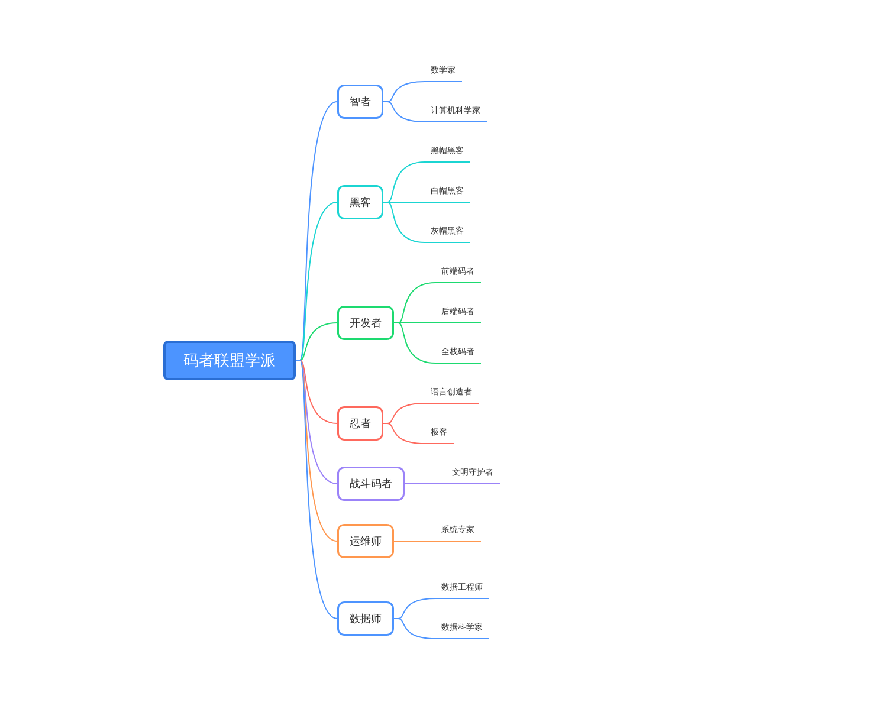
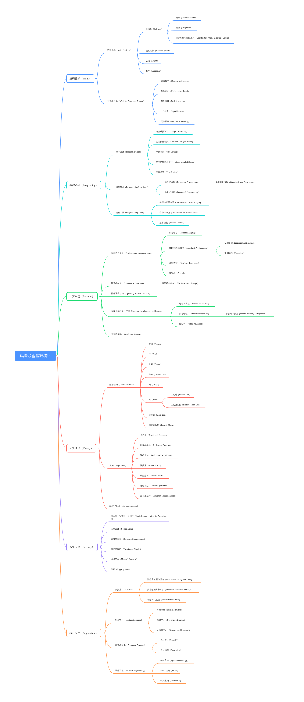
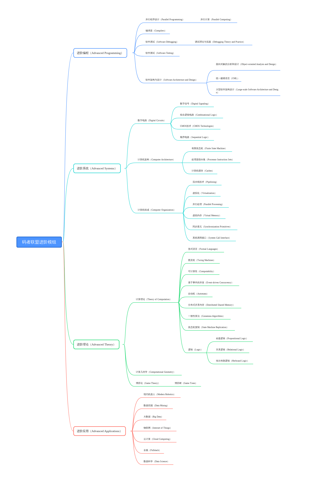

# 码者联盟

码者联盟（The League of Coders）公布了码者等级和分支，供众码者参考。代码改变世界，是码者联盟的口号。二十一世纪初，随着科技的发展，码者成为了社会中最庞大的职业，几乎各行各业都需要编程开发，尤其是工程和科研，社会运行重度依赖各种程序。

## 码者联盟码者等级

### 码奴

又称无名者，典型的程序员大众。有的甚至是因为这个时代而成为码者，而非真正地自愿地写代码。这些人本来跟编程没有任何关系——但是，他们却在编程。

### 码徒

他们是代码的爱好者。会为了编程的乐趣写作开源代码。他们的程序和想法展现出一种热情和希望。

### 码工

大部分码者处于这个等级。他们就是普通码者的写照，他们按规矩做事，既不需要创新，也不会惹麻烦。

### 码匠

对编程有热情，有悟性，肯钻研，最终可精于一门技术，也就是开发团队里的高级开发或资深开发。

### 码师

他们就是架构师级别的码者，有一定知名度。出没于大公司和有活力的创业团队。

### 码神

有知名度，而且通过自己的代码创建了公司——甚至开创了整个行业。这种码者享有绝对的自由度：自由的选择自己想做的事情。并且能把这种自由分享给跟他一起的码者同伴。这是大多数码者都向往渴望的级别。达到这种级别通常更多的是依靠商业技巧，而不是编程。

### 码圣

你的代码存活了下来，超越了你的死亡。你将在计算机史上记下永恒的一笔。其他的码者将会研究你的成果和著作。你也许获得过图灵奖，或写出过有影响力的论文，或发明了一两件重要的、影响到编程史进程的技术。

## 码者联盟学派

码者联盟现分为七大学派，其中战斗码者已失传。进入码者联盟后码者必须选择加入六大学派中的一派，每个学派都有各自的传统，象征着码者的荣耀。

### 智者

智者学派偏重理论。他们通常是学院里的教授，大公司或者研究院里的科学家。他们可以是数学家，也可以是计算机科学家，精通算法，创造算法。

### 黑客

黑客学派是码者联盟里最为神秘的一个学派。个中高手云集，有好有坏，并不会因为道德律而不接受一个码者。黑客学派的分支有黑帽黑客，他们未经授权访问系统，破坏重要数据，被认为是罪犯。

白帽黑客是指通过实施渗透测试，识别网络安全漏洞，为政府及组织工作并获得授权或认证的黑客。他们也确保保护免受恶意网络犯罪。他们在政府提供的规章制度下工作，这就是为什么他们被称为道德黑客或网络安全专家。

灰帽黑客属于介于白帽黑客和黑帽黑客之间的一类。他们不是合法授权的黑客。他们的工作既有好的意图，也有坏的意图。灰帽只是想证明自己的实力。

### 开发者

开发者学派是码者联盟里最大的学派。大部分码者从开发者做起。开发者的分支有前端码者、后端码者和全栈码者。全栈码者虽然必须兼通各类代码，但不精通，适合做草稿系统。开发者经晋升后可成为架构师或者创业公司中的技术骨干。

### 忍者

忍者学派是码者联盟里最为古老的学派，也是大部分码者想要获得的尊称，只有他们能创造语言。但是忍者学派不像开发者学派一样兼收并蓄，忍者学派只接受天才码者。

### 战斗码者

战斗码者，一手现代科技，一手混合格斗，光与影的平衡，文明世界的守护者。曾经的码者联盟的战士，但是这个学派已经失传，码者联盟里没有任何一个导师能引导战斗码者。他们的存在就是这个世界的传说。

### 运维师

运维师学派是一个辅助性的学派，其中不乏精通系统的天才系统工程师。一个系统能否运行，看的就是运维师们的实力。

### 数据师

数据师学派是码者联盟里一个新兴的学派。随着人工智能深度学习的普及，大数据成为绝对的趋势。数据工程师和数据科学家层出不穷。

## **码者联盟相关**

### **破码者**

Codebreakers

一个极端组织，仇恨所有码者。他们认为这个社会中码者的数量太多，挤占了其他人的工作机会，整个社会失去平衡。他们采取极端手段攻击码者，并说这是“献祭”。破码者很快被星龙国取缔，转入地下活动，仍有零星的犯罪。

### **自由码者**

Free Coders

所有并未加入码者联盟的码者都称作自由码者。他们以自己的脚步和规条写着代码，没有人能束缚他们，因此有的自由码者成为了法外狂徒。

## 码者联盟模组

### 码者联盟基础模组

Basic Modules for Coders

这是一个码者需要学习的基础理论与实践模组。学完这个模组的码者自动成为码工级码者，获得码者联盟基础模组证书。这是一个四年学习模组，与码者的大学课程相当。有的自由码者在加入码者联盟之前，必须先获得码者联盟基础模组证书。

### 码者联盟进阶模组

Advanced Modules for Coders


这是一个码者想要进阶的必修理论与实践模组。学完这个模组的码者自动成为码匠级码者，获得码者联盟进阶模组证书。这是一个两年学习模组，与码者的研究生课程相当。许多大的编码公司要求码者获得码者联盟进阶模组证书。

