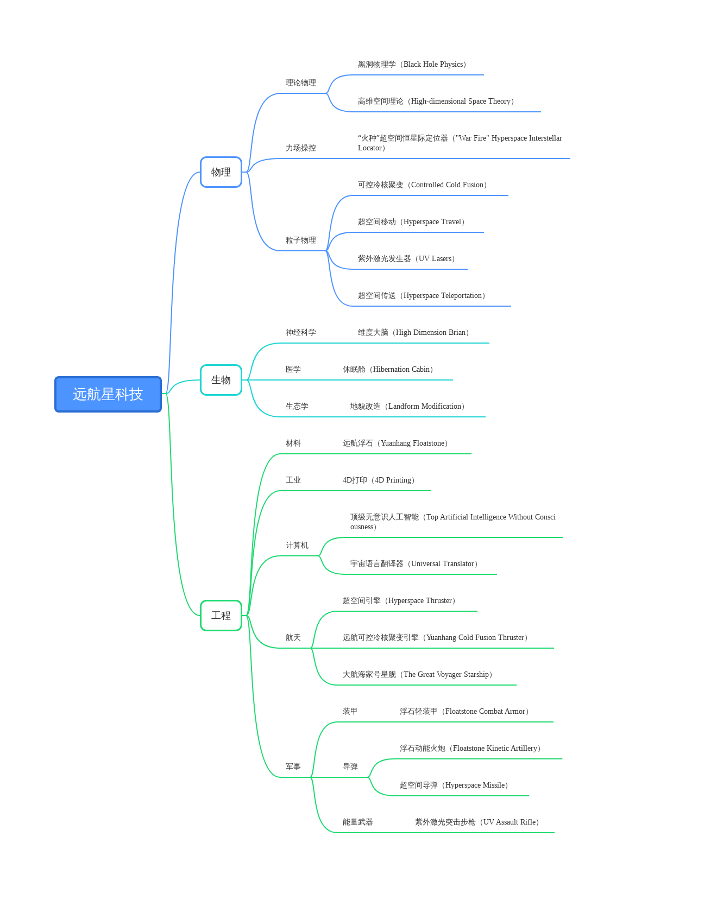

# 远航星科技21个

## 物理

### 理论物理

**黑洞物理学（Black Hole Physics）**

由于濒临噬星者黑洞，远航星人有第一手黑洞数据。黑洞数据让他们发展出真实的黑洞物理学理论，并找到打开高维空间的方式。为了研究黑洞物理学，他们曾派遣视死者（Shisizhe）科学家飞向黑洞传回数据。这些科学家都死了。

**高维空间理论（High-dimensional Space Theory）**

高维空间理论是远航星的科学基础，这种理论同样围绕黑洞展开，被应用到远航星生活的方方面面。例如超空间通讯、超空间传送、超空间移动，是的远航星人只对远航有兴趣，这就是他们的生活。

### 力场操控

**“火种”超空间恒星际定位器（"War Fire" Quantum Interstellar Locator）**

“火种”通过超空间将信息传回远航星。“火种”只能被点燃一次，单向传递信息。这项科技并不完善，不能双向传递大量信息。所以远航者对是否点燃“火种”非常谨慎，一旦点燃就意味着远航者舰队主力会降临，意味着战争。

### 粒子物理

**可控冷核聚变（Controlled Cold Fusion）**

远航星因为对浮石的使用，使冷核聚变装置变为可能。他们没有用到感知型人工智能就制造出了这项技术。获得几乎用不尽的清洁能源。这坚定了他们不走人工智能技术和生物改造技术路线的思路。

**超空间移动（Hyperspace Travel）**

远航者远在超光速飞行变为可能之前，就向四面八方都派遣1/20光速的飞船。他们对于冒险的决心是不可比拟的。经过多年的研究，他们终于成功研发在超空间内稳定航行的技术，这又是多条人命换来的。

**紫外激光发生器（UV Lasers）**

这些武器精准而充满毁灭性，可以造成巨大的杀伤。这为远航星人进行星际殖民奠定了能量武器的基础。不但如此，远航者们成功将这项技术小型化，分发给每一个远航者。一次充能可以在整场战役中使用。

**超空间传送（Hyperspace Teleportation）**

远在超空间航行变为可能之前，远航星人就掌握了超空间传送技术。他们能将远航者从飞船上直接传送到地面，这为登陆部队提供了便利。但这种传送是单向的，必须站在传送器内才能使用。

## 生物

### 神经科学

**维度大脑（High Dimension Brian）**

因为对超空间的掌握，远航者可以使用这种技术，激活大脑的高维计算能力。将多个远航者的大脑连通，一起进行堪比人工智能的运算。他们用这种方式代替感知型人工智能的使用，每次战场指挥都会用到维度大脑。

### 医学

**休眠舱（Hibernation Cabin）**

远航者用休眠舱进行休眠，度过漫长的星际旅行时光。这种休眠舱无需将远航者冷冻，而是使用维度科技激活了远航者体内自身的休眠系统。这让休眠的进入和退出都非常方便，不需要解冻技术。

### 生态学

**地貌改造（Landform Modification）**

由于黑洞的引力作用，远航星上布满浮石，大部分地方荒凉不适合居住。远航者们采用了地貌改造技术将这些地区变成人间天堂。他们不相信人工智能和基因改造，只相信自己的双手就能创造未来。

## 工程

### 材料

**远航浮石（Yuanhang Floatstone）**

远航浮石是远航星上特有的矿物。远航星人将它熔炼之后，可以用作抬起重物的材料，也可以用来制造轻型装甲。人类曾经想过与远航者交易浮石，但被远航者以科技机密为理由拒绝了。

### 工业

**4D打印（4D Printing）**

4D打印技术是指由3D技术打印出来的结构能够在外界激励下发生形状或者结构的改变，直接将材料与结构的变形设计内置到物料当中，简化了从设计理念到实物的造物过程，让物体能自动组装构型。

### 计算机

**顶级无意识人工智能（Top Artificial Intelligence Without Consciousness）**

远航星人也有计算技术，他们已经将弱人工智能做到了极致，比如说舰船自动驾驶，大数据计算等。但是他们的宗教天神教不允许远航星人研究强人工智能技术，这是他们的绝对禁忌。

**宇宙语言翻译器（Universal Translator）**

远航星人已经掌握了语言的本质，因此只要输入足够多一种语言的文档进入他们的翻译器，他们就能翻译成远航星语。他们宁愿使用翻译器也不学习坤灵星上的语言，因为他们觉得坤灵人是劣等种族。

### 航天

**超空间引擎（Hyperspace Thruster）**

就像蜘蛛网上的丝线一样，多维空间的其他维度在大多数恒星的重力井之间运动。在这些超空间航道间理论上是可以进行超光速旅行的。这是远航者的移动方式，他们相信在超空间中能接近宇宙意识。

**远航可控冷核聚变引擎（Yuanhang Cold Fusion Thruster）**

这是远航者们的亚光速航行方式，能达到1/20光速。远在亚光速航行的时代，远航星就向宇宙的四面八方都发送了侦查船。这些舰船上的远航者除了舰长等核心成员外，多是远航星上的罪犯。远航者们认为他们最具有战斗意识。

**大航海家号星舰（The Great Voyager Starship）**

大航海家号星舰是一艘亚光速星舰。能搭载1000个远航者，远航者们认为这是殖民一个星球所必须的最少远航者。这艘星舰于2038年抵达坤灵星，船体破损，几乎毁于一旦。但坤灵星人接纳了他们。

### 军事

#### 装甲

**浮石轻装甲（Floatstone Combat Armor）**

这种装甲非常轻便而且防弹。由浮石熔炼与纳米金属一同制成。所有远航者都配备了这种装甲，因为他们每一个人都是宇宙意识的士兵。除非近距离正面射击，否则一般子弹无法穿透这种装甲。

#### 导弹

**浮石动能火炮（Floatstone Kinetic Artillery）**

射程极远的火炮，火力猛烈，而且准确性极高。浮石不但减轻了火炮的重量，更加强了磁线圈的磁场强度。这种火炮能摧毁敌方的星舰，当然前提是敌方有星舰。没有舰队成了远航者嘲笑人类的一点。

**超空间导弹（Hyperspace Missile）**

这是一种大规模杀伤性武器。运用能量使一个区域的维度瞬间上升，没有超空间稳定器的人或者目标会被瞬间的升维打击撕碎。这被远航星人叫做直接去见宇宙意识，是一种残酷的大杀器。

#### 能量武器

**紫外激光突击步枪（UV Assault Rifle）**

每个远航者都配备了一把紫外激光突击步枪。这种枪也涂了浮石，使之非常轻便，女性也可以轻易使用。所以远航者中每个人都是战士，因为每个人都能抗得起枪。这种武器对于坤灵人来说非常致命。

