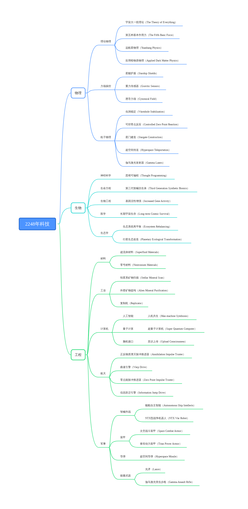

# 2248年科技37个

## 物理

### 理论物理

**宇宙大一统理论（The Theory of Everything）**

理论上宇宙间所有现象都可以用这四种作用力来解释。通过进一步研究四种作用力之间联系与统一，寻找能统一说明四种相互作用力的理论或模型称为大统一理论。经历了300多年的历程，人类终于能够统一量子力学和相对论。

**第五种基本作用力（The Fifth Basic Force）**

人类想象力以及科学观察力的极限在哪？除了万有引力、电磁力、强相互作用力、弱相互作用力之外，人类发现了维度力。既物质在升维降维时的作用力。这让人类打开了超空间的秘密。

**远航星物理（Yuanhang Physics）**

远航星的陷落让远航星先进的黑洞物理学，超空间物理学落入人类手中。虽然远航者已经摧毁了大量资料，但远航星的位置暴露后，噬星者黑洞的位置也暴露。人类通过研究噬星者黑洞获取了大量第一手数据。

**应用暗物质物理（Applied Dark Matter Physics）**

人类的物理学已经突破了物质的边界。暗物质是宇宙物质的主要组成部分，但又不属于构成可见天体的任何一种已知的物质。大量天文学观测中发现的疑似违反牛顿万有引力的现象可以在假设暗物质存在的前提下得到很好的解释。

### 力场操控

**星舰护盾（Starship Shields）**

护盾可以提供一定的伤害减免。人类首次对力场的控制达到出神入化的程度，普通导弹还有不够高能的激光都无法穿透力场护盾。它们会打在一片淡蓝色的六边形力场之上，止步于此。

**重力传感器（Gravitic Sensors）**

传感器能够探测到舰船扭曲时空运行时的引力波，因此能监视星域中来往的舰船。人类不再盲目作战，甚至能在舰队跃迁抵达一个星系之前，就接收到重力场波动的信息，提早防御，有备无患。

**诱导力场（Cynosural Field）**

诱导力场是大型舰船跳跃的目的点。这种旅行方式需要一位舰队成员在目的星系“点亮”一个诱导力场，并广播该力场，然后该舰队中的一个或多个旗舰驾驶员就可以利用他的跃迁引擎跃迁到诱导力场所在处。

### 粒子物理

**虫洞稳定（Warmhole Stabilization）**

通过稳定天然或者人造虫洞，进行星际航行。这项技术让虫洞跃迁成为可能，在共和国的主要星系和星区之间，人们都制造了大型的星门，供星舰通行。这些星门都采用了虫洞稳定技术，提供可进入的入口。同时也提供跃迁定位信息，供搭载了信息跃迁引擎的星舰航行。

**可控零点反应（Controlled Zero Point Reaction）**

人们现在能在真空中提取零点能。这是一种已知最高效的能源应用方式。现代科学家认为真空并不意味着一无所有，真空是由正电子和负电子旋转波包组成的系统。而与这种现象伴生的能量，称为零点能。

**星门建造（Stargate Construction）**

星门有两种作用，一种是稳定虫洞，另一种是提供跃迁诱导力场。星龙国所扩张到的星系——他们是基建狂魔，就会先修这种太空高速公路。直到共和国衰落后，仍能在大量星区之中找到星门。

**超空间传送（Hyperspace Teleportation）**

这原本是远航者通过研究黑洞物理得出的一种传送科技。现在被大规模应用在星龙人的太空探索之中。超空间传送器能在时空中撕裂出一个小的超空间，供人类进行传送。也可以传送物体。

**伽马激光发射器（Gamma Lasers）**

这是人类目前已知的最强大的激光发射器。它能发射高能伽马激光，是一种极度高频的激光光速，能迅速摧毁敌人的战舰。人们同时也投入了对这种激光的小型化应用，激光炮，激光突击步枪甚至手枪。

## 生物

### 神经科学

**思维可编程（Thought Programming）**

这是神经科学的皇冠。人们已经完全破解了人类思维的秘密，从此思维的产生就是一个透明的过程。人类能够通过脑机接口对思维进行编程，由此带来的思维控制能力让社会陷入需要新社会学的困境之中。

### 生命方程

**第三代智械仿生体（Third Generation Synthetic Bionics）**

大脑采用超量子计算核心，骨骼采用零号材料，接入重力感应通讯系统。躯体的其余部分采用仿生体纳米材料。躯体由零点能驱动，可以不充电几乎运行到永远。这种智械超越了人类的想象力极限。

### 生物工程

**基因活性增强（Increased Gene Activity）**

简要而言，这让人类能活到250岁，同时大大延长青壮年时期。一个人能有180年左右的青壮年时期。这种科技配合克隆体意识上传，人几乎已经达到永生。人类无需羡慕智械漫长的生命，这是人第一次接近和智械的平等。

### 医学

**长期宇宙生存（Long-term Cosmic Survival）**

先进的医疗舱让人类能够适应长期在宇宙中生存，而不肌肉萎缩。这项技术为长时间的宇宙航行奠定了人类基础。人类从此成为跨星系物种，星龙人征服了星空。他们的征途永远是星辰大海。

### 生态学

**生态系统再平衡（Ecosystem Rebalancing）**

以现在的生态学技术，人类能迅速修复一个生态系统。让它变得适宜居住。即使是水土流失、核污染的星球，他们都可以将其人类宜居化。这引起了一些环保人士的不满，认为人造的环境在取代大自然。

**行星生态改造（Planetary Ecological Transformation）**

人类已经能改造血云星的气候，使它暖化，适合人类生存。既然血云星的红土地上都可以有人类的足迹，那么整个宇宙何尝不会在人类的手中。行星生态改造技术让大范围的跨星系殖民变为可能。

## 工程

### 材料

**超流体材料（Superfluid Materials）**

超流体是一种物质状态，特点是完全缺乏黏性。如果将超流体放置于环状的容器中，由于没有摩擦力，它可以永无止尽地流动。时空或许是某种形式的超流体。超流体是一种物质状态，完全缺乏黏性，正由于没有摩擦力，它可以永无止境地流动而不会失去能量。

**零号材料（Neutronium Materials）**

是指原子中仅含中子，不含质子的一种元素，或纯粹只由中子组成的物质。零号元素已主要指代中子星内部存在的一种高密度、无质子的元素，目前多以多中子核物质来表示许多中子聚集在一起所形成的核素，这种物质目前仅存在于中子星内部。

### 工业

**恒星系矿物扫描（Stellar Mineral Scan）**

人类的采矿船可以通过扫描一个恒星系来确定其中的矿物含量。这让工业的火焰照耀到整个宇宙。这些采矿船全是由人工智能控制的自动开采机械，源源不断地为星龙国提供跨星系的矿物。

**外星矿物提纯（Alien Mineral Purification）**

人类首次提纯浮石成功，标志着一个新的外星工业纪元的开始。人们已经拥有提纯多项外星矿物的技术，没有人能阻挡星龙国成为天河系里的制造中心。新型的外星矿物也让巨型结构的建造变得可能。

**复制机（Replicator）**

这是3D打印的升级版，只不过这次是分子层面上的复制。这使工业生产进入了一个复制的时代，轻工业制品异常丰富，人类的物质生活质量也很高。人类尚未能够直接复制生物，但那一天有可能到来。

### 计算机

#### 人工智能

**人机共生（Man-machine Symbiosis）**

人类与机器最终能够携手进化，人通过意识上传成为机器，机器通过仿生体成为人类。这两个种族之间的关系密不可分。梁风的愿望实现了，他看到了一个人机共同进化的未来，他的一生已经活够。

#### 量子计算

**超量子计算机（Super Quantum Computer）**

超越量子计算，直击宇宙的本质。计算的边界在哪里，算力是否能无限提升。人类和智械现在要问的是想象力的问题，或许有一天智械会接入整个宇宙的信息流，成为宇宙永恒的一部分。

#### 脑机接口

**意识上传（Upload Consciousness）**

人类不再做人类，成为机器，这是一种可能。何以为人，又何以为智械？这个界限已经变得模糊，伦理上的讨论也已经过时。人与机器最终融合。不过星龙国第一个意识上传的人类是键客。

### 航天

**正反物质湮灭脉冲推进器（Annihilation Impulse Truster）**

正反物质湮灭如今是可靠的亚光速推进手段。可以将星舰加速到1/10光速，这为迅速抵达战场提供了可能。一个星舰通常会搭载一种亚光速推进器，一种超光速推进器。正反物质湮灭脉冲推进器就是标配。

**曲速引擎（Warp Drive）**

这是一种超光速引擎。曲速技术设想通过在宇宙飞船周围出了一种正常时空的人工“气泡”，使得飞船可以安全的以快于光速的几个数量级的速度航行，同时又回避了时间膨胀的相对论性的问题。

**零点能脉冲推进器（Zero Point Impulse Truster）**

这是已知最快的亚光速引擎，可以达到光速的1/5。只有共和国最优质的星舰装配了这种极其强大的亚光速推进器。人们不禁想，在零点能之后，他们还能研究什么。有什么是想象力之外的新亚光速飞行手段。

**信息跃迁引擎（Information Jump Drive）**

已知宇宙中最强超光速引擎。采用修改宇宙“源代码”的方式，将物质化作信息流，为了使跃迁更为精确，可以加上诱导力场作为辅助。但不需要诱导也可以使用信息跃迁引擎，它同时难以被重力传感器监测到。

### 军事

#### 智械作战

**舰船自主智能（Autonomous Ship Intellects）**

自动驾驶星舰进行复杂的超光速或者亚光速航行，以及作战。这让太空舰队都实现无人化，使惨烈的太空战争中人类的伤亡减到最低。这也让共和国的敌人们瑟瑟发抖。他们将要面对的是一只机械化的星舰。

**NTX型战争机器人（NTX War Robot）**

NTX型战争机器人是UTX型的进阶版。它搭载零点能驱动装置，超量子计算核心。除了没有仿生皮肤，它与智械的配置几乎一致。外壳采用零号材料，能防御远处的激光武器。NTX型战争机器人是可怕的战争武器。

#### 装甲

**太空战斗装甲（Space Combat Armor）**

外壳采用零号材料和浮石的混合，它既轻便又能适应高强度的太空战斗。甚至搭载了小型护盾。这是星龙太空军的标准配备。有人认为军人的生命不值得这个价格的装甲，但星龙人不这么认为。

**泰坦动力装甲（Titan Power Armor）**

泰坦动力装甲是最新型号的动力装甲。星联邦军工的杰作，这些泰坦动力装甲是星际骑士的标配。宇宙战争虽然大范围地无人化，但人类总有属于自己的一个角落。泰坦动力装甲就是这样的装备。

#### 导弹

**超空间导弹（Hyperspace Missile）**

远航星物理让人类也掌握了超空间导弹。这种导弹能在正常四维空间中撕裂出一个开口，让所影响区域瞬间升维。又叫升维打击。这是一种宇宙级的数学武器，由距离噬星者黑洞很近的远航星首先研发。

#### 能量武器

**光矛（Lance）**

光矛是搭载在星舰上的超级激光武器。它有5分钟的充能时间，一旦启动，可以摧毁几乎所有战舰的护盾。这种武器是终极的宇宙战争武器之一，就差那些能摧毁整个星球的歼星武器了。

**伽马激光突击步枪（Gamma Assault Rifle）**

这种突击步枪轻便而高效。是星龙太空军的标配。它能发射强烈的伽马激光，一次充能就能在整场战役中使用。它的枪身涂抹了浮石材料，使之变得十分轻便，即使是普通人类女性也能使用。

