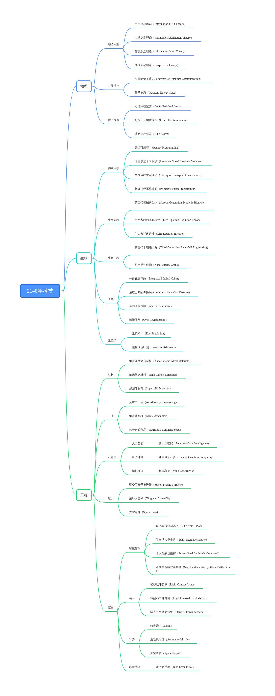

# 2148年科技47个

## 物理

### 理论物理

**宇宙信息场论（Information Field Theory）**

宇宙的基本组成不是物质，而是信息。这解释了超距作用的形成，又为时空操控提供了新的理论基础。如果能“修改”宇宙的代码，就可以快速地进行空间旅行。甚至能对时间进行操控，控制它流逝的速度。

**虫洞稳定理论（Wormhole Stabilization Theory）**

如果制造虫洞，如何稳定它。这个理论提供了一种全新的时空操控方式的思路。它是ER=EPR理论的进阶。自从人类首次观察到小型虫洞，人们就在实验室内尝试制造和稳定虫洞。这为星际旅行带来曙光。

**信息跃迁理论（Information Jump Theory）**

这个理论为制造信息跃迁引擎提供了理论基础。这是宇宙信息场论的延伸，解释了信息如何随着量子纠缠而跃迁。接下来要研究的，就是如何将物质信息化，使之以信息子的形式存在，进行跃迁。

**曲速驱动理论（Warp Drive Theory）**

时空的弯曲使得物体能以超光速旅行而同时保持在一条类时世界线上。跟虫洞一样，曲速推进也需要具有负能量密度的怪异物质。即使这种物质存在，也不清楚具体应如何布置这些物质来实现曲速推进。

### 力场操控

**恒星际量子通讯（Interstellar Quantum Communication）**

人类成功向远航星发送量子信息。量子通讯技术正式进入恒星际时代。这使得跨恒星系殖民扩张变得可能。虽然这次通讯有一个月的延迟，而且所包含的信息量极少，但这为地球人的远征提供了一种可能。

**量子能态（Quantum Energy State）**

基本的纠缠理论在能量生产中的应用使得能源输出量大幅增加。这种理论不但运用在可控核聚变之中，更应用在可控正反物质湮灭之中。使发电量大幅度提升，人类从此进入了星际能源时代。

### 粒子物理

**可控冷核聚变（Controlled Cold Fusion）**

可控冷核聚变的出现，改变了智械的供能方式。他们不再需要充电就能稳定运行100年。人类也用冷核聚变来供能动力装甲，这是战争机器的飞跃。人类从此拥有安全，稳定的清洁能源。

**可控正反物质湮灭（Controlled Annihilation）**

宇宙中存在着我们看不见摸不着的“反物质世界”，它的基本属性同我们周围的世界正好相反。可控正反物质湮灭进一步提升了人类使用能源的可能，它目前仍在实验室阶段，不久后就会用在飞船推进器上。

**蓝激光发射器（Blue Lasers）**

比红色激光器更加强大，对有机生物来说，这种波长的电磁辐射看上去是蓝色或紫色的。射程达到20千米，激光功率在千万瓦级以上。蓝色激光的温度和强度都超过红色激光，它的制成改变了激光武器。

## 生物

### 神经科学

**记忆可编程（Memory Programming）**

人类的记忆不再是秘密。人们能够自由地提取和输入记忆，这种技术被广泛使用在改造人身上，让他们有一段忠诚的记忆。正所谓记忆塑造一个人，一个人的性格和意志都可以通过记忆修改来重塑。

**语言快速学习模块（Language Speed Learning Module）**

虽然人工智能机器翻译耳机已经普及，但能够破译人脑的语言学习机制，让人对大脑的功能有深入的了解。这项技术能通过脑机接口，让一个人迅速掌握一门新的语言，为全宇宙的沟通打下了基础。

**生物自我意识理论（Theory of Biological Consciousness）**

在强人工智能被制造出来后的许多年，人们终于在了解生物体的自我意识上有了关键性的理论。人们终于理解了何为思想，何为智慧。这项理论的提出，让生物可编程研究进一步发展，人类将可能制造新的智慧生命。

**初级神经系统编码（Primary Neuron Programming）**

只有生物可编程才能让人类赶上人工智能的进化步伐。人们尝试对思想进行编辑，这比单纯编辑记忆要难得多，所以这项技术只是初步使用。人类仍不能完全掌控、修改一个人的意识，虽然他们能将人的意识下载到克隆体之中。

### 生命方程

**第二代智械仿生体（Second Generation Synthetic Bionics）**

大脑采用量子计算核心，骨骼采用新型纳米瓷金复合材料，接入量子通讯系统。躯体的其余部分采用仿生体纳米材料。躯体由冷核聚变驱动，可以不用充电运行100年，到了100年后，新一代躯体又被造出来了。

**生命方程的演化理论（Life Equation Evolution Theory）**

生命方程如果用在整一颗星球的生物演化上，会有怎样的效果？思唯就会成为坤灵星上的神。她能创造万物，与万物同在。制造出真正的生物多样性，保持自然系统的平衡，为人类打造最佳生存环境。

**生命方程改造液（Life Equation Injection）**

这种改造液是一种救命用的改造液，需要使用者的基因数据，它能治愈所有致命伤。这是思唯给自己女儿的一件礼物，祝愿她的远航顺利。梁夜一直将它带在身边，无论去到宇宙哪里都会想起母亲。

### 生物工程

**第三代干细胞工程（Third Generation Stem Cell Engineering）**

人类开始使用干细胞技术来延缓衰老，这使人的寿命能达到200岁。改造人也可以使用干细胞技术延长自己的生命，但是他们通常没有足够的钱去这么做。社会因此出现大规模的不公。

**纳米活性作物（Nano-Vitality Crops）**

在作物中融入少量的纳米机器人帮助我们创造出了一种具有极强恢复力的作物，其化学组成在整个生命周期都可以进行定制和改变。人类几乎能在任何环境下生产食物，这解决了所有人的吃饭问题。

### 医学

**一体化医疗舱（Integrated Medical Cabin）**

得了病，只需要在医疗舱里躺一晚上，它就能诊断并治疗大部分疾病，为大部分伤口做手术。人类的生存幸福感大幅度提升，医疗从昂贵变得低廉，这是人工智能给与人类的技术，它让世界更美好。

**治愈已知病毒性疾病（Cure Known Viral Diseases）**

病毒的机理被彻底掌握，从此不会再有死于病毒感染的人。病毒性疾病，包括远航星的幻痛症，不过是基因编辑系统的漏洞。当人类能编辑自身的基因，他们就有了对抗所有病毒的武器。

**基因健康保障（Genetic Healthcare）**

生物医学研究开辟了一个全新的领域。检测并保持一个人的基因健康程度，成为了这个时代的医疗标志。人只需要一份基因样品，即可以使用这项服务。有基因缺陷的人因此更容易被人歧视。

**细胞修复（Cyto-Revitalization）**

随着共和国日益强大，人类对自身的生物结构也更加了解。先进的细胞层面的医疗手段可以使人们的健康状况大幅提升。人类已经能在细胞层面上修复大部分伤口，这让曾经的致命伤如果救治及时，也不会致命。

### 生态学

**生态模拟（Eco Simulation）**

通过人工智能来模拟各种环境与气候条件，可以使作物的产量更加可控。人类几乎可以在任何地方种植农作物。这是星龙国数千年来的梦想，他们的天赋就加在种菜上。与自然和谐共处。

**选择性落叶剂（Selective Defoliants）**

这项科技不但可以用来快速清理密林地貌，还可以用来清理杂草，让作物更加健康地生长。这是一个不可多得的生态控制科技，因为这种落叶剂的毒性不是很高，却能有效去除杂草，是一项农业技术。

## 工程

### 材料

**纳米瓷金复合材料（Nano Ceramo-Metal Materials）**

此类装甲由多种金属和陶瓷结合，能显著增强舰体防御，而灵活不减。这使人类的亚光速舰船更为坚固。它也可以用来制造智械的骨骼，轻盈而且与仿生体皮肤贴合良好。这是一种实用价值高的材料。

**纳米塑钢材料（Nano Plasteel Materials）**

塑钢由多种塑料和金属结合而成，富有弹性，造价低廉。有的建筑以塑钢作为结构支架，这让更高层的建筑成为可能。星龙国是塑钢材料生产的第一大国，每年都出口到世界各地，援助基建。

**超固体材料（Supersolid Materials）**

这种材料密度很大，可以用作制造战争机器人、动力装甲以及战斗装甲。这种材料的出现，让激光武器成为战场的主流。虽然超固体材料非常坚硬，但它也无法阻挡正面直射的蓝色激光。

### 工业

**反重力工程（Anti-Gravity Engineering）**

在指向性重力科技的帮助下，星球地表的建筑可以达到前所未有的高度，而不必担心结构崩塌。通天塔指日可待。基建狂魔星龙国对此深有研究，它已经用此扩展了超级城市群，他们的目标是让地表覆满城市。

**纳米装配机（Nanite Assemblers）**

使用程控的纳米机器人辅助新机器单位的建造能够让其使用更为先进的模板并装备更好的子系统阵列。无人工厂的精度和产量达到前所未有的境地，工人阶级完全消灭于坤灵星。人们更多从事创意行业。

**营养合成食品（Nutritional Synthetic Food）**

喝一杯饮料就足够一天所需的所有营养。营养合成饮料改变了人类的饮食习惯和文化，人们将它造出各种人造口味，草莓、巧克力和香草。就连吃货大国星龙国也无法抵挡它们的诱惑。

### 计算机

#### **人工智能**

**超人工智能（Super Artificial Intelligence）**

只有超人工智能能用来形容思唯了。自从她上线之后，她就一直与血痕一道提升自己的实力。如今量子计算革命发生后，思唯的计算速度比之前有了百倍的提高，她已经接近宇宙中纯粹智慧的存在。

#### **量子计算**

**通用量子计算（General Quantum Computing）**

量子计算是一种遵循量子力学规律调控量子信息单元进行计算的新型计算模式。对照于传统的通用计算机，其理论模型是通用图灵机；通用的量子计算机，其理论模型是用量子力学规律重新诠释的通用图灵机。

#### **脑机接口**

**构建心灵（Mind Construction）**

一个人的心灵和意志是怎样的存在？人类如今能使用脑机接口在人类和改造人身上构建性格和意志，这项技术造成了大量的伦理问题。因此被禁止大规模使用，但是在人类至上主义者看来，这是人类反超智械的机会。

### 航天

**聚变等离子推进器（Fusion Plasma Thruster）**

由聚变能推动的等离子推进是电推进的高级形式，赋予舰船更快的亚光速航速和更好的机动性。这能使舰船达到1/20光速。这是亚光速条件下，一种先进的推进系统。下一步就是研究正反物质湮灭推进器了。

**星环太空城（Xinghuan Space City）**

星环太空城，又叫星环城。是一座巨大的太空城市。它是如此之大，以至于人们可以在上面种菜。这是星龙国人安土重迁思维的又一处体现，在殖民下一个恒星系之前，先建造太空城。

**太空电梯（Space Elevator）**

太空电梯是人类构想的一种通往太空的设备。与普通电梯类似，不同的是，它的作用并不是让乘客往返于楼层之间，而是将他们送入距地球约3.6万公里的星环太空城。太空电梯的主体是一个永久性连接太空站和地球表面的缆绳，可以用来将人和货物从地面运送到太空站。

### 军事

#### **智械作战**

**UTX型战争机器人（UTX War Robot）**

UTX型战争机器人是RTX系列的进阶版，它搭载冷核聚变动力核心，量子计算核心。可以说除了没有仿生皮肤，它和智械的配置几乎一样。战争机器人的外壳采用超固体材料，能防御远处的激光武器。

**半自动人类士兵（Semi-automatic Soldier）**

通过脑机接口，人工智能可以半自动操控人类或者改造人士兵。这种半自动操控形态，让士兵们有了一半的格式塔思维。能够更好地看到战争的全貌，但有时候智械会操纵士兵去送死，这引发伦理争议。

**个人化战场指挥（Personalized Battlefield Command）**

智械的算力突破是如此巨大，以至于原本只用于精锐部队的个人化战场分析，已经能够涵盖每一个士兵。这难以想象的计算量，通过量子计算全部解决。现在每一个士兵都有智械护航，大大提高了战斗力。

**海陆空智械战斗集群（Sea, Land and Air Synthetic Battle Group）**

智械是现在战争的主角。他们的身影横跨海、陆、空，建立了三位一体的打击体系。未机械化的世界如果与人类进入战争，将会面对一支几乎无人化的军队。这给敌方重大的心理打击。

#### **装甲**

**轻型战斗装甲（Light Combat Armor）**

这些由超固体材料制造的战斗装甲，轻盈而且有效。这是这个时代士兵的标配，它们能适应各个环境的登录作战，并有效保护士兵的躯体。连女性战士也能轻易驾驭这种盔甲，使女性战士数量增多。

**轻型动力外骨骼（Light Powered Exoskeletions）**

一改以往沉重的动力外骨骼，这款外骨骼能帮士兵举起笨重的激光炮，能帮助士兵跳跃，使之能深入原本不能的地形。连女性战士也能轻易驾驭这种动力外骨骼，使女性战士数量增多。

**曙光五号动力装甲（Dawn V Power Armor）**

曙光五号动力装甲是一种最新型号的动力装甲。星联邦的士兵们依旧喜欢亲自上战场而不是像星龙一样将一切都交给智械。动力装甲是星联邦人的浪漫。他们会在动力装甲上喷涂不同的颜色和符号。

#### **导弹**

**轨道炮（Upgraded Railgun）**

轨道炮是最新的电磁加速炮，轨道炮通过并行双轨加速炮弹使之以难以置信的高速发射出去。这种炮是线圈炮的进阶，是大炮巨舰主义者们的浪漫。这种电磁炮的速度和破坏力都是无与伦比的。

**反物质导弹（Antimatter Missile）**

这是不可控的正反物质湮灭导弹，反物质武器是一种能量，推进剂或爆炸物，拥有最强大力量的武器。这是比聚变炸弹更为致命的武器，能瞬间造成大范围杀伤，而且不留下核辐射区域。

**太空鱼雷（Space Torpedo）**

这些鱼雷是巨大导弹。它们装备了更加强大的弹头，聚变或者反物质。这是第一代太空武器，用来摧毁其他星舰。鱼雷的行进速度不快，但是星舰不一定能及时躲避。这是太空站的序幕。

#### **能量武器**

**蓝激光手枪（Blue Laser Pistol）**

蓝色激光手枪实现了激光小型化，所有人都能携带这种强力的武器。这进一步降低了战争的门槛，让不少没受过训练的人都有机会上战场。当然他们要面对的是无人化部队，这造成的恐惧非常严重。
