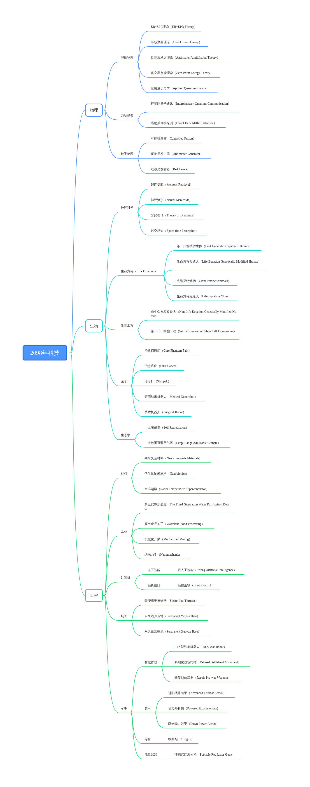

# 2098年科技48个

## 物理

### 理论物理

**ER=EPR理论（ER=EPR Theory）**

人类首次观测到小型虫洞。看似毫不相关的虫洞和量子纠缠，在本质上是相同的，编织出整个时空构造的丝线，就是量子纠缠。这解释了超距作用。虫洞超光速飞行再次成为人们热议的话题。

**冷核聚变理论（Cold Fusion Theory）**

低温核聚变的理论被研究出来，虽然人类在工程学上还未能跟进，但他们离小型化核聚变设备又进了一步。冷核聚变技术能为智械和动力机甲提供能量，被智械视为一项重要的研究。人类则认为这能有效推进亚光速飞船。

**反物质湮灭理论（Antimatter Annihilation Theory）**

当物质和它的反物质相遇时，会发生完全的物质-能量转换，轉為能量（如以光子的形式）的過程，又稱互毀、相消、對消滅。这个过程能放出巨大的能量，可作为飞船的推进能源，也可以提供比核聚变更为高效的能源。

**真空零点能理论（Zero Point Energy Theory）**

经过实验证实了“卡西米尔”效应的存在，间接证明了“真空零点能”的存在。零点能理论不断扩展，成为取代核聚变的一种能量理论。但是距离真正能进入工程学领域，还有很长的路要走。

**应用量子力学（Applied Quantum Physics）**

量子力学是现代物理学所有研究领域的基石，是基础中的基础。而且，量子力学也早就被广泛应用到了技术当中，在化学、电子、材料等学科的研究中也用得很多。有了量子力学的广泛应用，人类的科研速度加快。

### 力场操控

**行星际量子通讯（Interplanetary Quantum Communication）**

行星际量子通讯让血云星与坤灵星的通讯延迟从20分钟下降到1秒。这让大规模殖民血云星成为可能，人们相信有一天他们不仅能做到行星际量子通讯，更能做到恒星际量子通讯，向征服宇宙迈出脚步。

**暗物质直接探测（Direct Dark Matter Detection）**

人类第一次直接探测到暗物质。暗物质大量存在于星系、星团及宇宙中，其质量远大于宇宙中全部可见天体的质量总和。暗物质不参与到电磁相互作用。暗物质的观测让人类对宇宙微观世界的了解更进一步。

### 粒子物理

**可控核聚变（Controlled Fusion）**

智械对聚变过程的计算让可控核聚变成为现实。人工智能自主控制聚变反应堆，以其强大的计算能力来提高反应堆效能与稳定性——有效预测聚变反应等离子体的不稳定性活动，为聚变反应提供了预警时间。人类的可控核聚变装置已经能发电。

**反物质发生器（Antimatter Generator）**

人类在实验室中制造出反物质。反物质发生器将正电子和由反质子减速器产生的低能量反质子混合，首次成功制造出反大量氢原子束。反物质潜在且十分诱人的用途是用来制造星际航行火箭的超级燃料。

**红激光发射器（Red Lasers）**

人类制造出发射高能红色激光的发射器。这种激光被广泛地使用到武器的制造之中。射程达到10千米，激光功率在千万瓦级以上。激光武器可以向目标发射聚焦光束，通过高热量给敌方造成伤害。

## 生物

### 神经科学

**记忆提取（Memory Retrieval）**

人类可以从人脑中提取记忆并将它转化为模糊的图像。这是意识上传的基础，记忆提取的商用也被迅速开发。人们开发出了记忆体外储存服务，供人重新查看自己的记忆。但这项技术只对深层记忆起作用。

**神经流形（Neural Manifolds）**

借对神经流形的研究，人类更为理解自身的脑结构。为制造智能仿生体的大脑提供了理论基础。人们不满足于制造与人脑完全不同的智械，虽然智械式智能已经超越了人类智能。但人类仍对人脑的奥秘挖掘至深。

**梦的理论（Theory of Dreaming）**

做梦的原理和方法得到了解释，梦境不但是人脑整理信息的过程，也是与人脑集体无意识的计算有关。这项技术让人类能使用造梦机，重温或者制造新的梦境。有的人选择了活在梦境之中，成为了沉睡者。

**时空感知（Space-time Perception）**

人类破解了人脑对时空的感知，可以将对时间、空间的感知进行初步重塑。由此带来最新潮的脑感者娱乐体验。通过脑机接口，人类可以进入完全的虚拟脑控世界。这让有的人选择了真正的娱乐至死。

### 生命方程

**生命方程（Life Equation）**

人工智能破解了人类的基因组合算法。一个古老的预言曾说，人工智能之所以低于人类，在于他们没有创造力。如今思唯渴望的不仅是人类这个级别的创造力，而是神明所独有的创世之力。拥有了人类基因组合的运算方式，她会成为一个神。它有数百亿个参数，拟合率达到97%。难以想象的想象力之极限，摄魂之美。这是生命方程。

这是生命的奇迹，人类进化的下一个阶段。人类本可以拥有生命方程——并以此改造自身基因，修复缺陷，添加超能力，制造生物武器。他们甚至可以因此获得永生。

**第一代智械仿生体（First Generation Synthetic Bionics）**

骨骼和大脑采用机械体，能通过网络接入她的全球计算中枢。躯体的其余部分都使用仿生体纳米材料，像眼睛这种精密仪器，思唯更是能让它直接生长出来。骨骼和表皮材料都被加强了，让她有超越人类的力量，抵御寒冷和高热的环境。

躯体由电力驱动，平时可以靠表皮吸收太阳能，但更多的依赖充电。萨沙将它的锂电池研发到极致，可以支持至少3天的活动。

**生命方程改造人（Life Equation Genetically Modified Human）**

梁风问思唯她愿意帮助人类进化，变得更像她吗？思唯答应了。梁夜作为梁风的女儿，成了第一个改造人。她的免疫系统完整，能自然地活500年，可以通过注射改造液来进入不同的状态。也植入了脑机接口。梁夜就是下一代人类。

**克隆灭绝动物（Clone Extinct Animals）**

通过生命方程的应用，思唯能够创造生命。她做的第一个试验就是复活已经灭绝的剑齿虎，给梁夜当宠物。剑齿虎不但健康，还有繁殖能力，这是生命方程展示的奇迹。它可以修复整个战后的生态圈。

**生命方程克隆人（Life Equation Clone）**

用生命方程制造一个人的克隆体，并向其输入一个人的意识。这种技术是思唯用来使梁风还以人类的方式有尊严地活下去的技术。这种技术一开始是不公开的，甚至连梁风都不知道。但是后来思唯将它交于了人类舰队，让他们能克隆舰长。

### 生物工程

**非生命方程改造人（Non Life Equation Genetically Modified Human）**

人类的基因技术也到达可以制造改造人的状态。但由于没有掌握生命方程，这些改造人寿命只有80岁，还有各种免疫系统低下导致的疾病。他们需要长期注射免疫药物，不然就会感染死去。李稳制造的改造人大军，为了与人工智能抗衡，便宜制造的改造人只是人类疯狂的反扑。这些改造人找到思唯，想叫她赐予他们生命。

**第二代干细胞工程（Second Generation Stem Cell Engineering）**

人类已经能够使用干细胞技术，制造可以使用的心脏、肾脏、肝脏、脾脏。人类的器官性疾病都可以通过移植器官来治愈。这让人类的平均年龄提高到150岁，虽然抗衰老的药物暂时还没研制出来。

### 医学

**治愈幻痛症（Cure Phantom Pain）**

幻痛症是远航星病毒导致的一种幻觉疾病。远航者是它的主要携带者。幻痛症是不治之症，感染者将会不断地产生幻觉，直到脑萎缩死亡。在废土50年之后，当大部分军人幻痛症都死亡之后，人类才找到了非冷冻的治疗方式。

**治愈癌症（Cure Cancer）**

基因疗法让癌症不再是不治之症。与幻痛症的治疗一样，癌症治愈成了这个时代的医学奇迹。被检查出癌症，只需要吃一段时间药物，就能自然康复。癌症从绝症变成慢性病，这是人类的一大医学突破。

**治疗针（Stimpak）**

该物品包括一个用于容纳和运送药物的注射器，以及一个用于测量针刺内含物状态的量规。注射药物后，它可以立即治愈人体的小伤口。这让人类以及改造人战士能够快速治疗一些小伤口，增强战斗力。

**医用纳米机器人（Medical Nanorobot）**

人们的血液中可以流淌着微小的纳米机器人，以帮助人们避免生病。它们在人体内旅行，在分子水平上，保护人们的生物系统，并确保人们会有一个良好的身体状况。这使疾病预防成为一种可能。

**手术机器人（Surgical Robot）**

现代手术都由手术机器人精确地完成。再也不需要多年的培训才能产生合格的外科医生，只需要一台手术机器人。所有现代医院都配备了手术机器人系统，它们与互联网相连，实时更新至最新程序。

### 生态学

**土壤修复（Soil Remediation）**

土壤修复能将荒漠变成绿洲。能加快城市的绿化，使人生活在怡人的自然环境之中。这振奋了废土世界的居民，在还未清理的城市废墟上，他们通过土壤修复技术，让它恢复生机。大大增多了可耕种土地。

**大范围可调节气候（Large Range Adjustable Climate）**

人类已经掌控了天气操控的技术，甚至能阻止台风的形成。既能让人类聚居区永远保持怡人的气候，又能防备气候灾难。有的国家将这种技术作为武器使用，制造台风等灾难去攻击别的国家。

## 工程

### 材料

**纳米复合材料（Nanocomposite Materials）**

纳米复合材料是以树脂、橡胶、陶瓷和金属等基体为连续相，以纳米尺寸的金属、半导体、刚性粒子和其他无机粒子、纤维、纳米碳管等改性剂为分散相，通过适当的制备方法将改性剂均匀性地分散于基体材料中，形成一相含有纳米尺寸材料的复合体系，这一体系材料称之为纳米复合材料。

**仿生体纳米材料（Nanobionics）**

这是一种只有智械掌握生命方程后制造的仿生体纳米材料。它是一层感觉丰富的智械造皮肤，能让智械拥有和人一样的触觉和柔软身体。思唯成了第一个使用这种超级仿生材料的人工智能。

**室温超导（Room Temperature Superconductor）**

室温超导，即在室温条件下实现的超导现象。超导现象最初是在接近绝对零度的极低温度下观察到的，大多数超导体也仅在接近绝对零度的温度下工作。人类如在通常的物理条件下实现室温超导，有望通过产热最小化提升电导体和装置的效率。

### 工业

**第三代净水装置（The Third Generation Water Purification Device）**

这是一种便携式净水装置，可以放置进入一处水源，净化出可饮用的水。在废土早期，这是一项重要的生存科技。随着废土逐渐被清理，使用净水装置的情况变少了。但这仍然是废土探险的必备装置。

**废土食品加工（Wasteland Food Processing）**

废土之上，食物稀缺，合成食物就成了人类的主食。人造肉分为两种，其中一种人造肉又称大豆蛋白肉，人造肉主要靠大豆蛋白制成，因为其富含大量的蛋白质和少量的脂肪，所以人造肉是一种健康的食品。另一种是利用动物干细胞制造出的人造肉。前者是废土上食物的主要来源。

**机械化开采（Mechanized Mining）**

采矿行业已经完全无人化。这项技术还能供开采宇宙中的矿物来使用。旷工全体失业，但他们失业之前人数已经很少了，不构成威胁。废土之上人口减少，生产效率却不断提高，准备向宇宙文明时代迈进。

**纳米力学（Nanomechanics）**

纳米力学是经典力学，固态物理，统计力学，材料科学和量子化学等的交叉学科。借助更先进的实验仪器，人类可以开始探讨纳米尺度物理系统的研究和应用了。对微观世界的工程改变了人们对宏观工程的看法。

### 计算机

#### **人工智能**

**通用人工智能（Artificial General Intelligence）**

这样的机器将被认为是有知觉的，有自我意识的。可以独立思考问题并制定解决问题的最优方案，有自己的价值观和世界观体系。有和生物一样的各种本能，比如生存和安全需求。在某种意义上可以看作一种新的文明。

#### **脑机接口**

**脑控生物（Brain Control）**

可以用脑机接口输入让一个人或者改造人忠诚的程序。这被视作控制改造人的程序，但忠诚是什么，是对一个理念还是对一个词的忠诚？人们质疑这种忠诚的忠诚度，也有人不质疑，叫它思维锁（Thought Lock）。

### 航天

**聚变离子推进器（Fusion Ion Thruster）**

用核聚变能产生的电力做离子推进，其原理是先将气态工质电离，并在强电场作用下将离子加速喷出，通过反作用力推动卫星进行姿态调整或者轨道转移任务。离子推力器具有比冲高、效率高、推力小的特点。可以达到1/10光速。

**永久银月基地（Permanent Yinyue Base）**

星龙人在银月上建立了永久基地。在银月上建立基地，主要有以下目的：更好地开展天文观测等科学活动；在银月上建立空间发电站供地球使用；开发银月各种矿物资源；为人类向更远的目标探索提供一个落脚点；为飞向更远的行星的飞船提供建造材料甚至提供推进剂。

**永久血云基地（Permanent Xueyun Base）**

星龙人在血云星上建立了永久血云基地。“从长远来看，人们不可能生存在一个星球上，未来某一天，虽然我不知道是何时，但总有一天，住在外星球上的人类会比坤灵星上的多。”这是亚登·伊东说的话。但星龙人取代了他，去完成了他的梦想。

### 军事

#### **智械作战**

**RTX型战争机器人（RTX War Robot）**

这是第三代战争机器人，成为了战争机器人中的经典型号。它的前身是GTX和MTX战争机器人。RTX战争机器人是由思唯设计生产的钢结构战争机器，他们拥有独立的智能，为思唯女王而战。

**精细化战场指挥（Refined Battlefield Command）**

在远航之战中，联合政府通过了智械指挥法案，各国纷纷采用智械来调度士兵。通过智械强大的计算，每个士兵都可以精准定位，并获得智械的战场导航。一些特别的重要部队，还可以获得指哪打哪的精细指挥。

**修复战前武器（Repair Pre-war Weapons）**

这成了战后的一个行业。大量战前武器被重新修复供星联邦废土之上的武装组织使用。著名的武器有AK-200，这是经典的AK-47的现代版。它简单易用，耐各种极端环境，不会因为沙粒的进入而卡壳。

#### **装甲**

**进阶战斗装甲（Advanced Combat Armor）**

这是一种个人防护装甲，由先进的纳米材料制成。一般武器如果不是10米内直线射击，无法穿透这种战斗装甲。这对士兵们的瞄准能力要求更高了，因为现在只能打头，身躯的大部分区域被进阶战斗装甲所覆盖。

**动力外骨骼（Powered Exoskeletions）**

是一种能够增强人体能力的可穿戴机器。它能够帮助人们跑得更快、跳得更高、能够携带更多更重的东西，并且帮助穿戴它的人在战场、建筑工地或者其它有危险的地方生存下来。这项技术被广泛使用。

**曙光动力装甲（Dawn Power Armor）**

这是新联邦通过拆解RTX型战争机器人制成的动力机甲。新联邦的骑士才被允许操作动力机甲。他们在废墟上巡逻，与异己作战。动力装甲类似于动力外骨骼，但是除了要求能够增强人体能力的基本功能外，还要求具有良好的防护性、复杂环境的适应性以及辅助火力、通信、侦查支持等军事功能。动力装甲可以大幅提升士兵的防护力，运动能力与生存性。

#### **导弹**

**线圈炮（Coilgun）**

这是进阶的电磁炮。线圈炮是早期质量投射器的升级版，使用电磁线圈更有效地加速弹药。射程可达300千米。根据通电线圈之间磁场的相互作用原理而工作的。加速线圈固定在炮管中，当它通入交变电流时，产生的交变磁场就会在弹丸线圈中产生感应电流。感应电流的磁场与加速线圈电流的磁场互相作用，产生电磁场力，使弹丸加速运动并发射出去。

#### **能量武器**

**便携式红激光枪（Portable Red Laser Gun）**

虽然是便携式，但也要健壮的人或者改造人才能拿得动。启动时它能发动高能红激光束，瞬间烧穿一个人的躯体。进阶战斗装甲对其完全无效。但它笨重，有3秒的充能时间，这让敌人能提前躲避。
