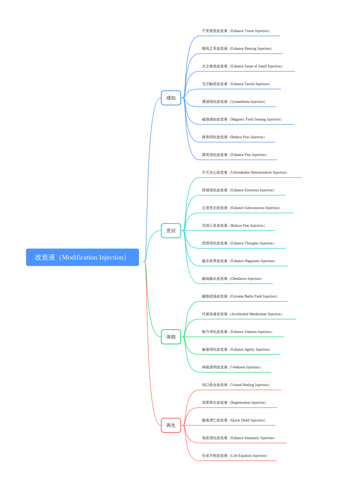

# 改造液25种

改造液是一种基因药物，改造人能通过注射改造液来强化或减弱某种身体机能。每一种改造液都有它的副作用，普通人如果注射了，会因为DNA双螺旋结构解体而死亡。改造人因为增强了基因结构，所以可以使用改造液。一个改造人不能同时承受3种以上的改造液，否则也会导致基因结构解体而死亡。

## 感知

**千里视觉改造液（Enhance Vision Injection）**

作用：增强改造人的视觉，让他能裸眼看到八倍瞄准镜的效果。这适合士兵进行狙击，但第一次使用会觉得非常头晕，无法控制。

有效时长：24小时。

副作用：药效消散后有2小时只有0.5的视力，视觉非常模糊，所以使用这种改造液需要在队友保护之下。

**顺风之耳改造液（Enhance Hearing Injection）**

作用：加强使用者的听觉，让他获得超级听力。能听见超声波和次声波，以及20分贝以下的微弱声音，也不会因为听见超过190分贝的声音而死亡。

有效时长：24小时。

副作用：药效消散后有2小时的致聋。

**犬之嗅觉改造液（Enhance Sense of Smell Injection）**

作用：加强人的嗅觉，使其像狗一样灵敏。可以用作犯罪现场的侦查，和野外的搜寻踪迹。

有效时长：24小时。

副作用：药效消散后有2小时的嗅觉失灵。

**无尽触觉改造液（Enhance Tactile Injection）**

作用：加强使用者的触觉，让即使最轻微的触碰都会传递大量的神经信号。改造人在做需要触感敏锐的手部精细操作的时候，会使用这种改造液。

有效时长：24小时。

副作用：药效消散后有2小时的触觉缺失。

**通感强化改造液（Synaesthesia Injection）**

作用：通感指其中一种感觉或认知途径的刺激，导致第二种感觉或认知途径的非自愿经历。数字和词语是有颜色的，还有形状、质地和情绪。这是一种超级感受能力，有助于思考，每个改造人使用这种改造液后都会有不同的通感能力。

有效时长：48小时。

副作用：药效消散后会有12个小时的全感知下降。

**磁场感知改造液（Magnetic Field Sensing Injection）**

作用：让改造人可以感知到磁场的变化，这是一种战争改造液，让改造人能感受到哪处的电磁波最强，通常能隔空定位智械。

有效时长：24小时。

副作用：药效消散后的2小时会有磁场感知紊乱。

**痛觉弱化改造液（Reduce Pain Injection）**

作用：这能让改造人忍受更多的痛苦。

有效时长：24小时。

副作用：药效消散后的2小时会浑身虚弱，连战立都不可能。

**痛觉强化改造液（Enhance Pain Injection）**

作用：这种改造液被广泛应用于审讯，能让改造人感受到更多的痛苦。

有效时长：24小时。

副作用：药效消散后的2小时改造人感觉不到任何痛苦。

## 意识

**不灭决心改造液（Unbreakable Determination Injection）**

作用：这种改造液能提高人的意志力，尤其是精神上的承受能力。这种改造液被广泛应用于战场之中。

有效时长：48小时。

副作用：药效消散后的12小时改造人会感觉到深入骨髓的绝望。

**情感强化改造液（Enhance Emotions Injection）**

作用：这种改造液能强化改造人的共情能力，使他们感受到更多情绪。

有效时长：24小时。

副作用：药效消散后的2小时改造人会情绪崩溃。

**泛潜意识改造液（Enhance Subconscious Injection）**

作用：应用潜意识中的运算能力，加强脑部的计算力，如果在使用途中睡觉，可以进入与集体无意识联结的预言梦。有的改造人被训练为先知，经常使用这种改造液。

有效时长：24小时。

副作用：药效消失后的2小时会分不清现实和幻象，过多使用这种改造液，会对大脑造成永久伤害。所以有的先知死于脑萎缩。

**无惧心灵改造液（Reduce Fear Injection）**

作用：使改造人失去恐惧这种情感。

有效时长：24小时。

副作用：药效消失后的2小时改造人会出现他们最为恐惧的事物的幻觉。

**思维强化改造液（Enhance Thoughts Injection）**

作用：强化数理思维的改造液，也同时能强化战略战术思维，是一种普遍在战场上使用的改造液。

有效时长：48小时。

副作用：药效消失后的12小时，改造人会神经虚弱，不能做任何复杂思维活动。

**极乐世界改造液（Enhance Happiness Injection）**

作用：刺激改造人的快感机制，让他们进入极端的快乐之中。

有效时长：24小时。

副作用：会上瘾，药效消失后的12小时改造人会陷入极端的伤心之中。过多使用这种改造液，会对大脑造成永久伤害。

**极端服从改造液（Obedience Injection）**

作用：可以让改造人变得极度服从命令，包括告诉提问者真实的信息。这种改造液被用来控制改造人。

有效时长：48小时。

副作用：改造人会逐渐失去自由意志。

## 体能

**极限战场改造液（Extreme Battle Field Injection）**

作用：可以全方位加强改造人的战斗能力，这是一种经常在战场上使用的改造液，因此得名。

有效时长：24小时。

副作用：药效消失后的2小时，改造人会变得虚弱。

**代谢加速改造液（Accelerated Metabolism Injection）**

作用：加速人体代谢速度，排出毒素，让改造人恢复状态。

有效时长：8小时。

副作用：药效消失后的30分钟，改造人会变得虚弱。

**耐力强化改造液（Enhance Stamina Injection）**

作用：增强改造人在进行耐力活动的能力，比如说长跑，长途行军，长途游泳。

有效时长：24小时。

副作用：药效消失后的2小时，改造人会变得虚弱。

**敏捷强化改造液（Enhance Agility Injection）**

作用：增强改造人在进行敏捷活动的能力，比如说飞檐走壁，保持平衡。

有效时长：24小时。

副作用：药效消失后的2小时，改造人会变得虚弱。

**体能虚弱改造液（Weakness Injection）**

作用：让改造人进入体能虚弱的状态，让他们不能活动。

有效时长：24小时。

副作用：使用超过3剂这种改造液，改造人会虚弱而死。

## 再生

**伤口愈合改造液（Wound Healing Injection）**

作用：注射在伤口组织处，这种改造液能愈合大部分伤口。

有效时长：30分钟到永久。

副作用：伤口再生时会感到非常疼痛。

**深度再生改造液（Regeneration Injection）**

作用：深入治疗全身内部和外部的伤口。

有效时长：12小时到永久。

副作用：再生时全身感到非常疼痛。

**极速凋亡改造液（Quick Death Injection）**

作用：让改造人无痛苦地快速死亡。

有效时长：5秒。

副作用：他死了。

**免疫强化改造液（Enhance Immunity Injection）**

作用：非生命方程改造人由于基因有缺陷，而且基因的多样化缺失，造成他们很容易感染疾病。他们需要每年注射免疫强化改造液。这也是别有用心的人控制改造人的方式。

有效时长：1年。

副作用：限制了非生命方程改造人的寿命，让他们只能活80年。

**生命方程改造液（Life Equation Injection）**

作用：这种改造液需要按使用者的基因来制造，还必须使用生命方程，它能治愈所有致命伤。是一种救命改造液。

有效时长：30分钟到永久。

副作用：再生时全身感到非常疼痛。

