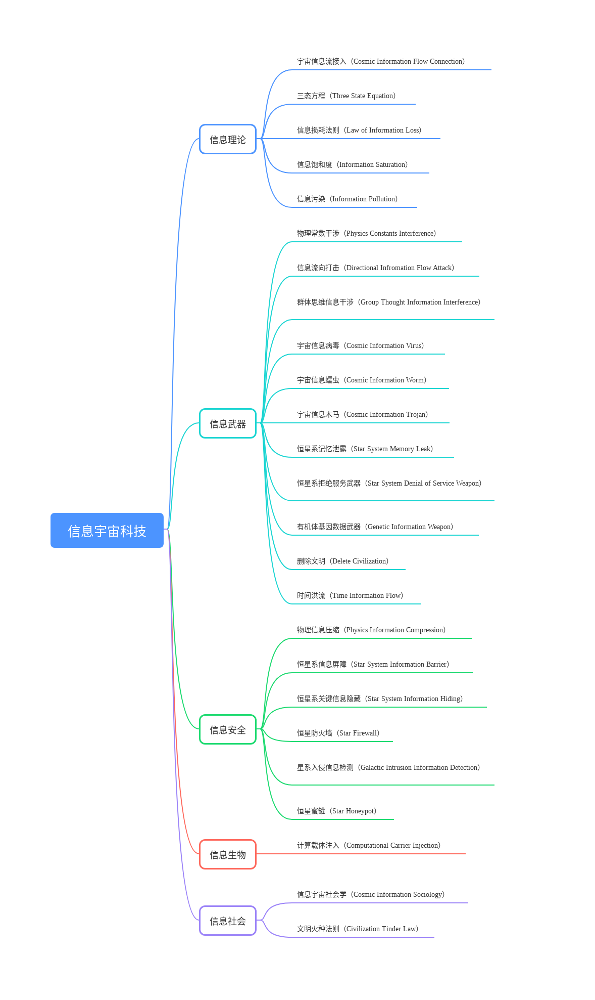

# 信息宇宙科技25个

## 信息理论

**宇宙信息流接入（Cosmic Information Flow Connection）**

这是一种基础的宇宙信息科技，第一是对信息的捕捉，第二是对信息的翻译，第三是对信息的干涉，第四是对信息的修改，然后就是速度和规模的问题了。这种科技需求宇宙信息场论和大量算力，是信息文明的基础。

**三态方程（Three State Equation）**

信息-物质-能量之间的转化规律，开启信息宇宙的大门。这让人们对宇宙的认识达到了一种新的高度，除了武器和之前不能想象的能源，还有艺术家对此进行创作。三态方程打破了人与造物主之间的限制。

**信息损耗法则（Law of Information Loss）**

当一个文明掌握的信息损耗率大于收集信息，这个文明可能存在内存泄露，就是这个信息文明的信息不守恒，信息会变得越来越简单。这会导致文明退化，因此高等信息文明必须不停地寻找新的信息源，新的信息科技。高等信息文明需要不断接入信息流，以维持文明的运转。

**信息饱和度（Information Saturation）**

信息的极度饱和对信息武器的能效有帮助，需要大量信息才能启动信息武器，就像需要数据才能进行运算。信息武器的定向需要大数据进行计算，找出与该星系信息传递最接近的函数，找出星系内有机体的信息通道。

**信息污染（Information Pollution）**

一旦一个区域被信息武器所打击，这个区域就会产生信息污染，无法移除。使用信息武器还可能导致整个宇宙系统出错，造成不稳定，最终可能耗尽整个宇宙的计算资源。宇宙可能会因此重启，即使连最高等的信息文明，都对此有所惧怕。

## 信息武器

**物理常数干涉（Physics Constants Interference）**

干涉某一特定空间范围内的物理常数，例如修改真空光速、自然对数的底、重力常量等常数，使整片星域产生低光速区，重力改变，甚至物理系统崩溃。例如说，真空状态粒子动能最低点为绝对零度，提高这个温度。也可以改变一个星球的大气性质和重力作用。

**信息流向打击（Directional Infromation Flow Attack）**

宇宙中的信息流是有高低落差的，信息饱和度高处，拥有信息势能，可以对低处进行信息修改。宇宙信息战中的双方不断修改、修正对方和自身的信息。处于绝对信息势能优势的文明，能修改一下信息，让别的文明没了。

**群体思维信息干涉（Group Thought Information Interference）**

思想也是信息的一种，修改星域里的信息场，通过大数据可以计算出一个文明当前的集体无意识结构。得出此模型后，接入射线场改变装置或者引力场改变装置，影响星域中的机器环境。一种可能的情况是对集体无意识输入自杀信息。也可以输入固化思维的信息，能瞬间瓦解一个星球的抵抗意志。也可以把一个社会登记森严伦理道德严格的星球，变成伦理混乱回归原始社会的星球。还可以引导文明往自己想要的方向发展。

**宇宙信息病毒（Cosmic Information Virus）**

这种信息病毒能寄生到该星域的信息场内，注入到信息洪流之中。当此处发生一定的信息消耗、处理、保持和复制时的某种行动，就会激活此宇宙信息病毒。防御方式是检测星域中的信息场，找到异常并摘除。

**宇宙信息蠕虫（Cosmic Information Worm）**

这种信息蠕虫是一个独立个体，能将自身的个体拷贝到该星域信息场内。它利用的是该信息场系统存在的漏洞，针对的是链接入这个信息场的所有物质和能量，比如说一颗恒星重力井中的行星。它自身就能触发感染。防御方式是为信息场漏洞打补丁。

**宇宙信息木马（Cosmic Information Trojan）**

宇宙信息木马驻留在该星域的信息场里，在信息场发生信息交换时自动运行，并执行一些事先约定的操作，如对信息场进行信息流混淆等，叫宇宙信息木马。这种信息武器一般分为远程计算端和目标信息场端。

**恒星系记忆泄露（Star System Memory Leak）**

每个恒星系重力井里有一定的信息缓冲区，但是信息量超过了其长度，可以造成缓冲区的溢出。从而让该星系的程序执行其他运算。这种攻击可以在一定时间内使行星静止，使恒星不再进行核聚变反应，星舰无法信息跃迁。

**恒星系拒绝服务武器（Star System Denial of Service Weapon）**

耗尽被攻击星系重力井内的计算资源，使其瞬间死机，所有生物停止运动卡死。这又叫时间停止攻击，可以卡死一个信息的时间计算。禁止其他星系与该星系进行数据交换。被攻击的星系会进入信息迷雾之中，失去连接。

**有机体基因数据武器（Genetic Information Weapon）**

这种攻击可以破坏有机体的基因结构，使其复制的时候产生大量乱码。这是一种去除星球表面有机体的方式，可以使星球更容易被殖民。也可以使星球表面的生物体面目全非，扭曲退化。这是一种针对有机体的攻击。

**删除文明（Delete Civilization）**

抹除一切关于一个文明的信息，此举需要大量时间和算力，会产生信息垃圾，造成信息污染。所以删除一个文明是会留下信息碎片星域的。信息垃圾是一种破碎的时空状态，以目前的科技无法清除。它是宇宙对篡改信息的日志。

**时间洪流（Time Information Flow）**

高等信息文明可以对社会运行做出预测，也能有限度修改时间相关信息。越是遥远的过去，越是复杂生命体的过去，就越需要算力，可能需要一整颗恒星上的巨型光能采集装置的能量，需要行星级计算机的算力。

## 信息安全

**物理信息压缩（Physics Information Compression）**

这个文明能够高度压缩自己存在的信息，保留一条信息的核心内容，去掉掩盖这条信息的冗余度。但是冗余度是一种安全机制，保证了消息能够到达，即使消息在传递过程中受到一些损坏。通过信息压缩，他们可以把三维的信息隐藏起来，完成后再恢复。这对战略隐藏自身有重要的作用。

**恒星系信息屏障（Star System Information Barrier）**

这种独特的信息场结构，辐射整个恒星系，构筑信息防御网。这种信息结构设计很巧妙，既能允许友军进行信息跃迁，也能防御一部分低等物理信息攻击，防止别的信息文明读取、翻译、干涉、修改本星系的信息场。

**恒星系关键信息隐藏（Star System Information Hiding）**

关于一个恒星系的关键数据可以被这项技术压缩并隐藏。关键信息包括此星系的物理常数，生物磁场，信息场参数。通过修改宇宙保存关键信息的信息洪流数据结构，可以修改关键信息的可见性。但对高级信息文明而言，这种隐藏并非绝对生效。

**恒星防火墙（Star Firewall）**

防火墙由信息流中注入的信息构成，用于加强信息信息场的访问控制，防止星系外的个体非法使用星系内的信息流，是一种双网隔离。这种技术首先要求该文明可以读取和修改信息流，其次需要大量能源支撑。

**星系入侵信息检测（Galactic Intrusion Information Detection）**

在星系的信息场内，对信息流进行检测，一旦发现异常数据流，就作出行动。检测系统并非一直有效，一些会隐藏和加密的信息，很可能逃避检测。但这是相比维持恒星防火墙更节省能源的一项科技。各信息文明都有采用。

**恒星蜜罐（Star Honeypot）**

蜜罐技术本质上是一种对攻击方进行欺骗的技术，以恒星信息场为诱饵，诱使攻击方对其实施攻击，从而可以对攻击行为进行捕惑和分析，了解信息武器的方法，推测攻击意图和动机。这是一种常见的防御方式。

## 信息生物

**计算载体注入（Computational Carrier Injection）**

信息可以被注入许多微观载体，并将生物体改造成半机械半有机的融合体。这种融合体可以直接下载信息洪流中的数据，与整个宇宙的机器环境同步。高等信息文明已经突破了生存的载体，他们可以生存在几乎任何形态之中，甚至是能量体。

## 信息社会

**信息宇宙社会学（Cosmic Information Sociology）**

高端文明寻求信息进步，中端文明寻求发展，低端文明寻求生存。高端文明是整个宇宙的干涉者、规则制定者和文明火种保存者。部分中低端文明是宇宙强盗、文明掠夺者或者某些高端文明的信息收集雇佣兵。

**文明火种法则（Civilization Tinder Law）**

在信息宇宙中，任何事物都可以作为信息存在，还可以有一个很有趣的情境——高端文明保存了所有有机体的信息，也就意味着他们可以复制所有有机体。中端文明出于威慑，不敢进行文明灭绝行动。有的文明被切断信息科技，但不允许灭亡。
